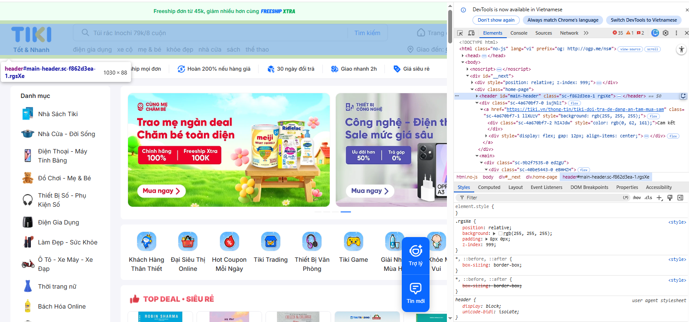
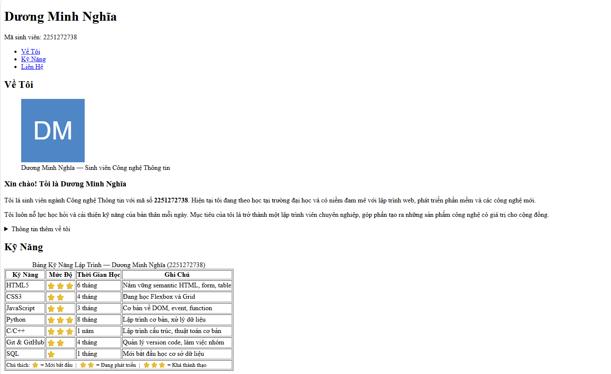
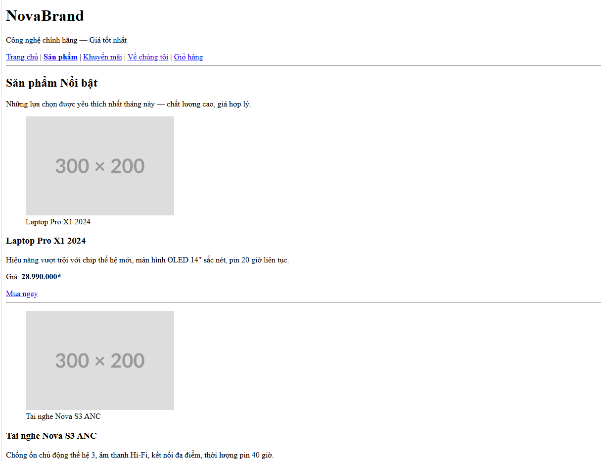
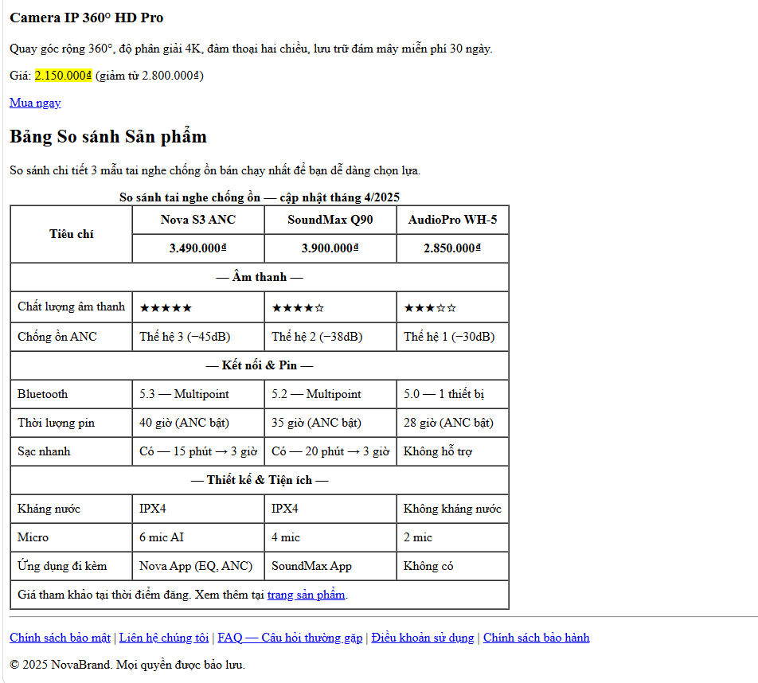
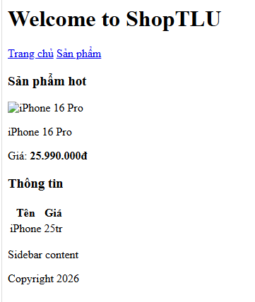

# PHẦN A: ĐỌC HIỂU

__Câu A1:__

I. 5 bước xảy ra khi truy cập https://shopee.vn (theo đúng thứ tự):
- Dựa trên quy trình "Cuộc hành trình 0.3 giây" và kiến trúc "Nhà hàng Online" trong tài liệu (Introduction và phần 1), các bước diễn ra là:

1. Gửi Request (DNS Lookup & Kết nối): Trình duyệt (Client) tiếp nhận URL, tìm địa chỉ IP của server Shopee và gửi yêu cầu (HTTP Request) qua Internet (đi qua router, nhà mạng, cáp quang...).

2. Server xử lý: Server của Shopee nhận được yêu cầu, "đầu bếp" (Server) sẽ xử lý logic, truy xuất dữ liệu (ví dụ: các mặt hàng sale, giỏ hàng của cậu).

3. Gửi Response: Server phản hồi (HTTP Response) bằng cách gửi các file cần thiết (HTML, CSS, JS) ngược trở lại cho trình duyệt qua "anh shipper" Internet.

4. Parse & Execute (Phân tích mã): Trình duyệt nhận file, bắt đầu đọc bản vẽ kiến trúc (Parse HTML), đọc thiết kế nội thất (Parse CSS) và lắp đặt hệ thống tương tác (Execute JS).

5. Paint & Render (Hiển thị): Trình duyệt hoàn thiện việc vẽ các điểm ảnh lên màn hình để cậu thấy giao diện trang chủ Shopee.
- Mở một trình duyệt web trang shopee và đánh giá kết quả tab Network:


__Câu A2:__

- Tại sao Google đánh giá thấp?

Google đọc HTML để **hiểu cấu trúc và nội dung** trang. Khi toàn bộ dùng `<div>`, Google không phân biệt được đâu là header, đâu là nội dung chính, đâu là sản phẩm → không index tốt → SEO kém.

---

❌ 4 Lỗi Semantic (+ bonus)

**Lỗi 1 — Thiếu `<header>`**  
`<div class="header">` không cho Google biết đây là phần đầu trang.

**Lỗi 2 — Thiếu `<nav>`**  
`<div class="menu">` không có tín hiệu điều hướng → Google không nhận ra đây là menu.

**Lỗi 3 — Thiếu `<main>` và `<article>`**  
`<div class="main">` và `<div class="product">` không thể hiện đây là nội dung chính và đơn vị sản phẩm độc lập.

**Lỗi 4 — `` thiếu `alt`**  
Thiếu `alt` → Google Images không index được, vi phạm accessibility.

**Lỗi 5 (bonus) — Thiếu heading tag**  
`<div class="title">` nên là `<h2>` để Google hiểu mức độ quan trọng của tiêu đề sản phẩm.

---

## ✅ Code đã sửa

```html
<!DOCTYPE html>
<html lang="vi">
<head>
    <title>Trang web</title>
    <meta charset="UTF-8">
</head>
<body>
    <header>
        <h1>Welcome to ShopTLU</h1>
        <nav>
            <a href="home">Trang chủ</a>
            <a href="products">Sản phẩm</a>
        </nav>
    </header>

    <main>
        <section>
            <h3>Sản phẩm hot</h3>
            
            <p>iPhone 16 Pro</p>
            <p>Giá: <b>25.990.000đ</b></p>
        </section>

        <section>
            <h3>Thông tin</h3>
            <table>
                <tr>
                    <th>Tên</th>
                    <th>Giá</th>
                </tr>
                <tr>
                    <td>iPhone</td>
                    <td>25tr</td>
                </tr>
            </table>
        </section>

        <aside>
            <p>Sidebar content</p>
        </aside>
    </main>

    <footer>
        <p>Copyright 2026</p>
    </footer>
</body>
</html>
```

---

## 📋 Bảng tóm tắt

| # | Lỗi | Cũ | Sửa |
|---|---|---|---|
| 1 | Header | `<div class="header">` | `<header>` |
| 2 | Navigation | `<div class="menu">` | `<nav>` |
| 3 | Nội dung chính | `<div class="main">` | `<main>` |
| 4 | Sản phẩm | `<div class="product">` | `<article>` |
| 5 | Tiêu đề | `<div class="title">` | `<h2>` |
| 6 | Ảnh | `` | thêm `alt`, `loading="lazy"`, bọc `<figure>` |

__Câu A3:__


```
┌─────────────────────────────────────┐
│ Hộp 1                               │  ← <div> chiếm cả dòng
└─────────────────────────────────────┘
[Text A][Text B]                          ← <span> nằm cạnh nhau
┌─────────────────────────────────────┐
│ Hộp 2                               │  ← <div> chiếm cả dòng
└─────────────────────────────────────┘
[Text C][Text D]                          ← <span> + <strong> cùng dòng
┌─────────────────────────────────────┐
│ Hộp 3                               │  ← <div> chiếm cả dòng
└─────────────────────────────────────┘
```

---

## Giải thích

**`<div>` là block element** → tự động chiếm toàn bộ chiều ngang, phần tử tiếp theo bị đẩy xuống dòng mới. Vì vậy 3 hộp luôn đứng riêng từng dòng.

**`<span>` và `<strong>` là inline element** → chỉ chiếm đúng phần nội dung, các inline element kế tiếp tự động nằm cùng dòng. Đó là lý do:
- `Text A` + `Text B` nằm cạnh nhau
- `Text C` + `Text D` nằm cạnh nhau

**`<div>Hộp 2</div>` chen vào giữa** → làm Text A/B và Text C/D bị tách ra hai nhóm riêng biệt — `<div>` luôn "ngắt dòng" dù nằm giữa các inline element.

---

## Bảng tóm tắt

| Thẻ | Loại | Chiếm chỗ | Xuống dòng? |
|---|---|---|---|
| `<div>` | Block | Cả dòng ngang | Có |
| `<span>` | Inline | Vừa nội dung | Không |
| `<strong>` | Inline | Vừa nội dung | Không |

__Câu A4:__

1. Phân biệt `<thead>`, `<tbody>`, `<tfoot>`

| Thẻ | Vai trò | Nội dung |
|---|---|---|
| `<thead>` | Header bảng | Tiêu đề các cột (`<th>`) |
| `<tbody>` | Thân bảng | Dữ liệu chính (`<td>`) |
| `<tfoot>` | Footer bảng | Tổng kết, tổng cộng (`<td>`) |


2. Tại sao KHÔNG dùng `<table>` để layout trang web?

**Lý do 1 — Sai ngữ nghĩa (Semantic)**
`<table>` sinh ra để chứa *dữ liệu dạng bảng*, không phải để chia cột layout. Google và screen reader đọc `<table>` = "đây là bảng dữ liệu" → hiểu sai cấu trúc trang → SEO kém, accessibility kém.

**Lý do 2 — Khó responsive**
Table mặc định có chiều rộng cố định theo nội dung, rất khó co giãn trên màn hình điện thoại. CSS Grid/Flexbox có thể `wrap`, `stack`, ẩn/hiện cột linh hoạt — table thì không.

**Lý do 3 — Code rối, khó bảo trì**
Layout bằng table phải lồng nhiều `<tr>`, `<td>` chỉ để chia cột → HTML phình to, khó đọc, khó sửa. Dùng CSS Grid chỉ cần vài dòng CSS là xong.

**Lý do 4 — Load chậm hơn**
Trình duyệt phải đọc *toàn bộ* table trước khi render (vì cần tính độ rộng từng cột). Layout CSS render từng phần tử ngay lập tức → trang hiển thị nhanh hơn.

---

## Tóm tắt

> `<table>` = dùng cho **dữ liệu** (danh sách sản phẩm, bảng so sánh, thống kê).  
> Layout trang web = dùng **CSS Grid / Flexbox**.

__Câu B4:__


1. 3 thẻ semantic HTML5 mà trang đó sử dụng (Tiki)

- Thẻ `<header>`:


- Thẻ `<main>`:


- Thẻ `<footer>`:


2. Thẻ `<table>`:

- Trong bảng có `<thead>` chứa hình ảnh sản phẩm, `<tbody>` chứa thông tin sản phầm tương ứng với mỗi hàng, mỗi cột của sản phẩm đó


# PHẦN B: THỰC HÀNH

__Câu B1:__

- Tạo profile với:

5đ: Cấu trúc semantic đúng (header/nav/main/article/section/aside/footer)

5đ: Table đúng cấu trúc (thead/tbody/tfoot)

3đ: Meta tags đầy đủ (charset, viewport, title)

2đ: Không dùng div thừa

**Bài làm:**



__Câu B2:__

- Tạo file *products.html* — trang danh sách sản phẩm

5đ: 4+ articles product card đúng cấu trúc

5đ: Table so sánh có colspan/rowspan

3đ: Hyperlinks hoạt động đúng (anchor links và external links)

2đ: Code indentation sạch, readable




__Câu B3:__



# Danh sách lỗi HTML

**Lỗi 1 — `<!DOCTYPE>` thiếu khai báo loại tài liệu**  
`<!DOCTYPE>` không hợp lệ → trình duyệt không biết đây là HTML5, có thể vào quirks mode. Sửa thành `<!DOCTYPE html>`.

**Lỗi 2 — `<title>` thiếu thẻ đóng**  
`<title>Trang web` không có `</title>` → trình duyệt có thể nuốt luôn thẻ `<meta>` phía sau vào trong title.

**Lỗi 3 — `charset` sai giá trị**  
`charset="utf8"` không phải tên chuẩn → một số trình duyệt không nhận. Giá trị đúng là `charset="UTF-8"` (có dấu gạch ngang).

**Lỗi 4 — `<h1>` dùng thẻ mở thay vì thẻ đóng**  
`<h1>Welcome to ShopTLU<h1>` → thẻ đóng phải là `</h1>`, không phải `<h1>`.

**Lỗi 5 — `<h1>` nằm ngoài `<header>` (semantic)**  
`<h1>` xuất hiện trước `<header>` → vi phạm cấu trúc ngữ nghĩa, tiêu đề trang nên nằm bên trong `<header>`.

**Lỗi 6 — `<a>` đóng sai thẻ**  
`<a href="home">Trang chủ<a>` dùng thẻ mở thay vì thẻ đóng → phải là `</a>`.

**Lỗi 7 — `` thiếu nháy và thiếu `alt`**  
`src=iphone.jpg` không có dấu nháy và không có thuộc tính `alt` → Google Images không index được, vi phạm accessibility. Sửa thành `src="iphone.jpg" alt="iPhone 16 Pro"`.

**Lỗi 8 — `<b>` và `<p>` lồng nhau sai thứ tự**  
`<p>Giá: <b>25.990.000đ</p></b>` → thẻ `<b>` mở bên trong `<p>` nhưng lại đóng bên ngoài, sai cấu trúc lồng nhau. Sửa thành `<p>Giá: <b>25.990.000đ</b></p>`.

**Lỗi 9 — Header bảng dùng `<td>` thay vì `<th>` (semantic)**  
`<td>Tên</td>` và `<td>Giá</td>` ở hàng đầu bảng không truyền tín hiệu tiêu đề → Google và screen reader không nhận ra đây là header. Sửa thành `<th>`.

**Lỗi 10 — Dùng `<main>` thứ hai thay vì `<aside>` (semantic)**  
Một trang chỉ được có một phần tử `<main>`. Sidebar content nằm trong `<main>` thứ hai → không hợp lệ. Sửa thành `<aside>` và đưa vào trong `<main>` hiện có.

**Lỗi 11 — `<p>` trong `<footer>` thiếu thẻ đóng**  
`<p>Copyright 2026` không có `</p>` → HTML không hợp lệ, dễ gây lỗi render.

**Lỗi 12 — Thiếu thẻ đóng `</html>`**  
File kết thúc mà không có `</html>` → tài liệu HTML không hoàn chỉnh.

# PHẦN C: SUY LUẬN

__Câu C1:__

- Bạn được giao thiết kế cấu trúc HTML cho trang chi tiết sản phẩm (giống trang sản phẩm Shopee/Tiki). Trang bao gồm:

1. Header + Navigation
2. Breadcrumb (Trang chủ > Điện thoại > iPhone 16)
3. Khu vực ảnh sản phẩm (5 ảnh)
4. hông tin sản phẩm (tên, giá, đánh giá sao, mô tả)
5. Bảng thông số kỹ thuật
6.  Khu vực đánh giá/bình luận
7. Sidebar: Sản phẩm tương tự
8. Footer

Bài làm:

```html
<!DOCTYPE html>
<!-- DOCTYPE bắt buộc để trình duyệt render ở chế độ chuẩn (standards mode) -->

<html lang="vi">
<!-- lang="vi" giúp screen reader đọc đúng ngôn ngữ, hỗ trợ SEO -->

<head>
  <meta charset="UTF-8">
  <!-- charset đầu tiên, trước mọi thứ, để parse đúng encoding -->

  <meta name="viewport" content="width=device-width, initial-scale=1.0">
  <!-- viewport bắt buộc cho responsive, không có thì mobile bị thu nhỏ -->

  <meta name="description" content="iPhone 16 - Camera đột phá, chip A18, màn hình Super Retina XDR">
  <!-- description là meta quan trọng nhất cho SEO snippet trên Google -->

  <meta name="robots" content="index, follow">
  <!-- robots cho phép crawler index trang sản phẩm -->

  <title>iPhone 16 256GB | Điện thoại Apple chính hãng - ShopTech</title>
  <!-- title: tên sản phẩm + danh mục + tên shop — công thức SEO chuẩn cho trang sản phẩm -->

  <link rel="canonical" href="https://shoptech.vn/dien-thoai/iphone-16">
  <!-- canonical tránh duplicate content nếu URL có query params (?color=black) -->
</head>

<body>
<!-- ============================================================
     HEADER — PHẦN ĐẦU TRANG
     ============================================================ -->

  <header>
  <!-- header: landmark element, bao toàn bộ phần đầu trang (logo + nav chính).
       Screen reader nhận diện ngay, skip-link có thể bỏ qua vùng này -->

    <a href="#main-content" class="skip-link">
    <!-- a dẫn đến #main-content: "skip navigation link" — accessibility bắt buộc
         Người dùng bàn phím/screen reader có thể nhảy thẳng vào nội dung -->
      Bỏ qua điều hướng
    </a>

    <a href="/" aria-label="ShopTech - Trang chủ">
    <!-- a bọc logo: chuẩn hơn <button>, vì logo luôn là liên kết về trang chủ.
         aria-label vì bên trong chỉ có , cần text thay thế cho screen reader -->
      
      <!-- img: logo là nội dung hình ảnh thật, KHÔNG dùng background-image CSS
           vì cần alt text cho accessibility và SEO -->
    </a>

    <search>
    <!-- search: HTML5.2 landmark mới, ngữ nghĩa rõ hơn <div role="search">
         Trình duyệt cũ fallback về block element, không bị lỗi -->
      <form action="/search" method="get" role="search">
      <!-- form: bắt buộc cho ô tìm kiếm — method GET vì search nên bookmark được.
           role="search" redundant nhưng tăng compatibility với screen reader cũ -->
        <label for="search-input">Tìm kiếm sản phẩm</label>
        <!-- label: PHẢI có cho input, liên kết bằng for/id — click label = focus input -->
        <input
          type="search"
          id="search-input"
          name="q"
          placeholder="Tìm điện thoại, laptop..."
          autocomplete="off"
        >
        <!-- type="search": đúng ngữ nghĩa hơn type="text", mobile hiện nút "Tìm kiếm"
             name="q": convention chuẩn của search param (?q=iphone) -->
        <button type="submit">
        <!-- button type="submit": submit form — KHÔNG dùng <a> vì đây là action, không phải navigation -->
          Tìm kiếm
        </button>
      </form>
    </search>

    <nav aria-label="Điều hướng chính">
    <!-- nav: landmark cho menu chính — aria-label phân biệt với các nav khác trên trang
         (breadcrumb, sidebar nav) để screen reader không bị nhầm -->
      <ul>
      <!-- ul: danh sách menu KHÔNG có thứ tự — thứ tự item menu không mang nghĩa quan trọng -->
        <li><a href="/dien-thoai">Điện thoại</a></li>
        <!-- li + a: li là item danh sách, a là liên kết — KHÔNG dùng li > button vì đây là navigation -->
        <li><a href="/laptop">Laptop</a></li>
        <li><a href="/phu-kien">Phụ kiện</a></li>
        <li><a href="/khuyen-mai">Khuyến mãi</a></li>
        <li>
          <a href="/gio-hang" aria-label="Giỏ hàng (3 sản phẩm)">
          <!-- aria-label thông báo số lượng cho screen reader — họ không thấy badge badge -->
            Giỏ hàng
            <span aria-hidden="true">3</span>
            <!-- aria-hidden="true": số 3 đã được đọc trong aria-label bên trên,
                 ẩn phần tử này khỏi accessibility tree để tránh đọc 2 lần -->
          </a>
        </li>
      </ul>
    </nav>

  </header>

<!-- ============================================================
     BREADCRUMB — ĐƯỜNG DẪN ĐIỀU HƯỚNG
     ============================================================ -->

  <nav aria-label="Breadcrumb">
  <!-- nav: breadcrumb là điều hướng — đặt NGOÀI <main> vì nó là chrome của trang,
       không phải nội dung chính. aria-label khác với nav chính bên trên -->

    <ol>
    <!-- ol (ordered list): breadcrumb CÓ THỨ TỰ — Trang chủ phải đứng trước Điện thoại.
         Google's structured data cũng expect ordered breadcrumb -->
      <li>
        <a href="/">Trang chủ</a>
        <!-- a: các bước trước là liên kết có thể navigate về -->
      </li>
      <li>
        <a href="/dien-thoai">Điện thoại</a>
      </li>
      <li>
        <a href="/dien-thoai/apple">Apple</a>
      </li>
      <li aria-current="page">
      <!-- aria-current="page": đánh dấu item hiện tại trong breadcrumb — KHÔNG dùng <a>
           vì đây chính là trang đang xem, không cần liên kết về chính nó -->
        iPhone 16
      </li>
    </ol>

  </nav>

<!-- ============================================================
     NỘI DUNG CHÍNH
     ============================================================ -->

  <main id="main-content">
  <!-- main: landmark quan trọng nhất — chỉ có DUY NHẤT 1 thẻ main mỗi trang.
       id="main-content" để skip-link ở header nhảy đến đây -->

    <!-- ---- KHU VỰC TỔNG QUAN SẢN PHẨM (ảnh + info) ---- -->

    <article>
    <!-- article: trang sản phẩm là một đơn vị nội dung độc lập, có thể syndicate
         (chia sẻ, nhúng) — đúng hơn <section> vì product detail tự đứng được -->

      <header>
      <!-- header bên trong article: semantic HTML5 cho phép header lồng nhau.
           Đây là phần giới thiệu của article sản phẩm, không phải header trang -->
        <h1>Apple iPhone 16 256GB</h1>
        <!-- h1: tiêu đề SẢN PHẨM là nội dung quan trọng nhất trang — chỉ 1 h1/trang.
             KHÔNG đặt h1 ở tên shop hay slogan, phải là tên sản phẩm để SEO đúng -->

        <p>
          <abbr title="Stock Keeping Unit">SKU</abbr>: IPH16-256-BLK
          <!-- abbr: viết tắt kỹ thuật cần giải thích — title hiển thị tooltip khi hover -->
        </p>
      </header>

      <!-- ---- ẢNH SẢN PHẨM ---- -->

      <section aria-label="Ảnh sản phẩm">
      <!-- section: khu vực ảnh là một phần riêng biệt của article.
           aria-label vì section không có heading con trực tiếp -->

        <figure>
        <!-- figure: ảnh sản phẩm là nội dung hình ảnh có chú thích — đúng hơn <div>.
             figure = "đây là hình ảnh có nghĩa, không phải decoration" -->

          
          <!-- img loading="eager": ảnh chính PHẢI load ngay — khác với ảnh thumbnail dùng lazy.
               alt mô tả chi tiết: màu sắc + góc chụp + tính năng nổi bật -->

          <figcaption>iPhone 16 — Ảnh chính thức từ Apple</figcaption>
          <!-- figcaption: chú thích nguồn ảnh — Google Images và screen reader đọc nó -->
        </figure>

        <!-- Danh sách ảnh thumbnail -->
        <nav aria-label="Ảnh thumbnail sản phẩm">
        <!-- nav: thumbnail là cách navigate xem ảnh sản phẩm — người dùng click để chuyển ảnh chính.
             Dùng nav thay vì ul bare vì đây là điều hướng nội dung -->
          <ol>
          <!-- ol: 5 ảnh có thứ tự (ảnh 1, 2, 3...) — người dùng kỳ vọng ảnh chính là đầu tiên -->
            <li>
              <button type="button" aria-pressed="true" aria-label="Xem ảnh 1: Mặt trước">
              <!-- button: click để đổi ảnh là ACTION, không phải navigation → KHÔNG dùng <a>
                   aria-pressed="true": toggle button — đang active.
                   aria-label: mô tả ảnh thumbnail cho người không thấy được -->
                
                <!-- alt="" (empty): ảnh thumbnail decorative — alt đã có ở aria-label của button parent -->
              </button>
            </li>
            <li>
              <button type="button" aria-pressed="false" aria-label="Xem ảnh 2: Mặt sau">
                
                <!-- loading="lazy": thumbnail ở dưới fold → lazy load để tối ưu performance -->
              </button>
            </li>
            <li>
              <button type="button" aria-pressed="false" aria-label="Xem ảnh 3: Cổng USB-C">
                
              </button>
            </li>
            <li>
              <button type="button" aria-pressed="false" aria-label="Xem ảnh 4: Camera sau">
                
              </button>
            </li>
            <li>
              <button type="button" aria-pressed="false" aria-label="Xem ảnh 5: Hộp sản phẩm">
                
              </button>
            </li>
          </ol>
        </nav>

      </section>

      <!-- ---- THÔNG TIN SẢN PHẨM (giá, đánh giá, mô tả) ---- -->

      <section aria-labelledby="product-info-heading">
      <!-- section: khu vực info độc lập với khu vực ảnh — aria-labelledby trỏ đến h2 bên trong,
           đây là cách đúng chuẩn hơn dùng aria-label trực tiếp -->

        <h2 id="product-info-heading">Thông tin sản phẩm</h2>
        <!-- h2: heading thứ hai, con của h1 "Apple iPhone 16 256GB" — đúng hierarchy -->

        <!-- Đánh giá sao -->
        <section aria-labelledby="rating-heading">
        <!-- section lồng: khu vực đánh giá là một đơn vị ý nghĩa riêng -->
          <h3 id="rating-heading">Đánh giá khách hàng</h3>

          <p>
            <span role="img" aria-label="4.8 trên 5 sao">
            <!-- role="img" + aria-label: biến span thành ảnh ngữ nghĩa.
                 Screen reader đọc "4.8 trên 5 sao" thay vì đọc từng ký tự ★★★★☆ -->
              ★★★★☆
            </span>

            <span>4.8</span>
            <!-- span: inline text không có ngữ nghĩa riêng — phù hợp cho số điểm -->

            <a href="#reviews">
            <!-- a: liên kết xuống section đánh giá bên dưới — đây là navigation, không phải action -->
              <span>(2,341 đánh giá)</span>
            </a>
          </p>
        </section>

        <!-- Giá sản phẩm -->
        <section aria-labelledby="price-heading">
          <h3 id="price-heading">Giá bán</h3>

          <p>
            <del>
            <!-- del: giá cũ đã bị xóa/thay thế — ngữ nghĩa "đây là giá không còn hiệu lực".
                 KHÔNG dùng <span class="old-price"> vì mất ngữ nghĩa -->
              <span aria-label="Giá gốc">29.990.000đ</span>
            </del>

            <ins>
            <!-- ins: giá mới được chèn vào thay thế — cặp đôi với del rất semantic.
                 Screen reader đọc rõ "giá mới" vs "giá cũ" -->
              <strong>
              <!-- strong: giá khuyến mãi QUAN TRỌNG — tạo semantic emphasis, không chỉ bold CSS -->
                <span aria-label="Giá khuyến mãi hiện tại">24.990.000đ</span>
              </strong>
            </ins>

            <mark>
            <!-- mark: highlight thông tin nổi bật trong context — ở đây là % giảm giá.
                 Khác <strong> (tầm quan trọng) — mark = "đáng chú ý trong ngữ cảnh này" -->
              Giảm 17%
            </mark>
          </p>

          <p>
            <small>Giá đã bao gồm VAT. Miễn phí vận chuyển toàn quốc.</small>
            <!-- small: thông tin bổ sung nhỏ, điều khoản — đúng ngữ nghĩa HTML5 hơn là chỉ giảm font -->
          </p>
        </section>

        <!-- Tùy chọn sản phẩm -->
        <section aria-labelledby="options-heading">
          <h3 id="options-heading">Lựa chọn</h3>

          <fieldset>
          <!-- fieldset: nhóm các input liên quan với nhau — ở đây là nhóm chọn màu sắc.
               Trình duyệt và screen reader hiểu đây là một nhóm form controls -->
            <legend>Màu sắc</legend>
            <!-- legend: label của fieldset — KHÔNG thay bằng <p> vì mất liên kết ngữ nghĩa -->

            <label>
              <input type="radio" name="color" value="black" checked>
              <!-- radio: chọn 1 trong nhiều màu — name giống nhau → cùng nhóm.
                   checked: màu mặc định đang chọn -->
              Đen (Midnight)
            </label>
            <label>
              <input type="radio" name="color" value="white">
              Trắng (Starlight)
            </label>
            <label>
              <input type="radio" name="color" value="blue">
              Xanh (Blue Titanium)
            </label>
          </fieldset>

          <fieldset>
            <legend>Dung lượng</legend>
            <label>
              <input type="radio" name="storage" value="128">
              128GB
            </label>
            <label>
              <input type="radio" name="storage" value="256" checked>
              256GB
            </label>
            <label>
              <input type="radio" name="storage" value="512">
              512GB
            </label>
          </fieldset>

          <label for="quantity">Số lượng</label>
          <!-- label: label độc lập cho input số lượng — for/id phải khớp nhau -->
          <input
            type="number"
            id="quantity"
            name="quantity"
            min="1"
            max="10"
            value="1"
          >
          <!-- type="number": đúng ngữ nghĩa — mobile hiện numeric keyboard.
               min/max: validation phía trình duyệt, không cần JS -->
        </section>

        <!-- Nút hành động -->
        <section aria-labelledby="actions-heading">
          <h3 id="actions-heading" hidden>
          <!-- hidden: heading ẩn về mặt visual nhưng vẫn tồn tại trong accessibility tree
               để screen reader biết đây là khu vực "Hành động mua hàng" -->
            Hành động mua hàng
          </h3>

          <button type="button">
          <!-- button type="button": thực hiện action (thêm vào giỏ) — KHÔNG phải navigation.
               type="button" tường minh để không accidentally submit form nào đó -->
            Thêm vào giỏ hàng
          </button>

          <button type="button">
            Mua ngay
          </button>

          <button type="button" aria-pressed="false" aria-label="Thêm vào danh sách yêu thích">
          <!-- aria-pressed: toggle button (yêu thích / bỏ yêu thích).
               aria-label vì button có thể chỉ chứa icon tim ♥ -->
            ♥ Yêu thích
          </button>
        </section>

        <!-- Mô tả ngắn -->
        <section aria-labelledby="short-desc-heading">
          <h3 id="short-desc-heading">Điểm nổi bật</h3>
          <ul>
          <!-- ul: danh sách điểm nổi bật KHÔNG có thứ tự ưu tiên (tất cả đều quan trọng như nhau) -->
            <li>Chip Apple A18, hiệu năng AI đột phá</li>
            <li>Camera 48MP với nút Camera Control vật lý</li>
            <li>Màn hình Super Retina XDR 6.1 inch, 2000 nit peak brightness</li>
            <li>Pin 18 giờ sử dụng, sạc MagSafe 25W</li>
            <li>Cổng USB-C với USB 3 tốc độ cao</li>
          </ul>
        </section>

      </section>

<!-- ============================================================
     BẢNG THÔNG SỐ KỸ THUẬT
     ============================================================ -->

      <section aria-labelledby="specs-heading">
      <!-- section riêng cho thông số kỹ thuật — quan trọng cho SEO (Google rich results) -->

        <h2 id="specs-heading">Thông số kỹ thuật</h2>

        <table>
        <!-- table: thông số kỹ thuật là DỮ LIỆU DẠNG BẢNG thật sự — tên thông số vs giá trị.
             Đây là use case ĐÚNG của <table>, khác với layout table bị cấm -->
          <caption>Thông số kỹ thuật chi tiết iPhone 16 256GB</caption>
          <!-- caption: tiêu đề bảng — luôn có để screen reader thông báo bảng này nói về gì
               trước khi đọc dữ liệu. KHÔNG thay bằng h3 bên ngoài -->

          <thead>
          <!-- thead: nhóm hàng tiêu đề — trình duyệt có thể repeat thead khi bảng dài và in -->
            <tr>
              <th scope="col">Thông số</th>
              <!-- scope="col": tiêu đề cột — screen reader biết "Thông số" là header của cả cột -->
              <th scope="col">Chi tiết</th>
            </tr>
          </thead>

          <tbody>
          <!-- tbody: nhóm hàng dữ liệu — tách biệt với thead/tfoot về ngữ nghĩa -->
            <tr>
              <th scope="row">Màn hình</th>
              <!-- th scope="row": tiêu đề HÀNG — "Màn hình" là label cho toàn bộ row đó -->
              <td>Super Retina XDR OLED, 6.1 inch, 2556 x 1179 px</td>
              <!-- td: dữ liệu thông thường -->
            </tr>
            <tr>
              <th scope="row">Chip xử lý</th>
              <td>Apple A18 Bionic, 6 nhân CPU, 5 nhân GPU</td>
            </tr>
            <tr>
              <th scope="row">RAM</th>
              <td>8GB</td>
            </tr>
            <tr>
              <th scope="row">Bộ nhớ trong</th>
              <td>256GB (không hỗ trợ thẻ nhớ ngoài)</td>
            </tr>
            <tr>
              <th scope="row">Camera sau</th>
              <td>
                48MP Fusion + 12MP Ultra Wide
                <br>
                <!-- br: xuống dòng trong cùng một ô dữ liệu — dùng hợp lệ trong td
                     khi muốn tách thông tin nhưng vẫn trong cùng một cell -->
                Quay video 4K 120fps Dolby Vision
              </td>
            </tr>
            <tr>
              <th scope="row">Camera trước</th>
              <td>12MP TrueDepth, Face ID</td>
            </tr>
            <tr>
              <th scope="row">Pin</th>
              <td>
                3,561 mAh
                <br>
                Sạc có dây 25W (MagSafe)
                <br>
                Sạc không dây 15W (MagSafe), 7.5W (Qi)
              </td>
            </tr>
            <tr>
              <th scope="row">Hệ điều hành</th>
              <td>iOS 18</td>
            </tr>
            <tr>
              <th scope="row">Kết nối</th>
              <td>5G, Wi-Fi 7, Bluetooth 5.3, USB-C (USB 3), NFC</td>
            </tr>
            <tr>
              <th scope="row">Kích thước &amp; Trọng lượng</th>
              <!-- &amp; thay & để tránh lỗi HTML parsing -->
              <td>147.6 × 71.6 × 7.8 mm — 170g</td>
            </tr>
            <tr>
              <th scope="row">Màu sắc</th>
              <td>Đen, Trắng, Xanh, Hồng, Xanh lá</td>
            </tr>
            <tr>
              <th scope="row">Bảo hành</th>
              <td>
                <time datetime="P12M">12 tháng</time> chính hãng Apple Việt Nam
                <!-- time: khoảng thời gian có machine-readable duration (ISO 8601).
                     datetime="P12M" = Period 12 Months — parseable bởi bot/calendar -->
              </td>
            </tr>
          </tbody>

          <tfoot>
          <!-- tfoot: hàng tổng kết/chú thích bảng — semantic footer của table -->
            <tr>
              <td colspan="2">
              <!-- colspan="2": ô gộp 2 cột — phù hợp cho chú thích chạy full width -->
                <small>* Thông số có thể thay đổi theo phiên bản màu sắc và khu vực.</small>
              </td>
            </tr>
          </tfoot>

        </table>

      </section>

<!-- ============================================================
     KHU VỰC ĐÁNH GIÁ / BÌNH LUẬN
     ============================================================ -->

      <section id="reviews" aria-labelledby="reviews-heading">
      <!-- id="reviews": để breadcrumb và anchor từ phần đánh giá sao trên scroll xuống đây -->

        <h2 id="reviews-heading">Đánh giá từ khách hàng</h2>

        <!-- Tổng quan đánh giá -->
        <aside aria-label="Tổng quan điểm đánh giá">
        <!-- aside trong section reviews: thông tin tổng hợp điểm số là "liên quan nhưng
             không phải nội dung chính" của section — đây là use case đúng của aside lồng -->
          <h3>Tổng quan</h3>
          <p>
            <strong>4.8</strong>
            <span role="img" aria-label="4.8 trên 5 sao">★★★★☆</span>
            <span>Dựa trên 2,341 đánh giá</span>
          </p>
          <dl>
          <!-- dl (description list): danh sách term-value — "5 sao: 1,823 đánh giá"
               đây là data pair, đúng hơn ul hay table cho trường hợp này -->
            <dt>5 sao</dt>
            <dd>1,823 đánh giá</dd>
            <dt>4 sao</dt>
            <dd>412 đánh giá</dd>
            <dt>3 sao</dt>
            <dd>73 đánh giá</dd>
            <dt>2 sao</dt>
            <dd>21 đánh giá</dd>
            <dt>1 sao</dt>
            <dd>12 đánh giá</dd>
          </dl>
        </aside>

        <!-- Form viết đánh giá -->
        <section aria-labelledby="write-review-heading">
          <h3 id="write-review-heading">Viết đánh giá của bạn</h3>

          <form method="post" action="/reviews/submit">
          <!-- form method="post": gửi dữ liệu nhạy cảm (đánh giá cá nhân) — POST ẩn data,
               không như GET làm lộ ra URL -->
            <fieldset>
              <legend>Điểm số của bạn</legend>
              <!-- fieldset + legend: nhóm radio đánh giá sao — cần rõ ràng cho screen reader -->

              <label>
                <input type="radio" name="rating" value="5" required>
                <span role="img" aria-label="5 sao">★★★★★</span>
              </label>
              <label>
                <input type="radio" name="rating" value="4">
                <span role="img" aria-label="4 sao">★★★★☆</span>
              </label>
              <label>
                <input type="radio" name="rating" value="3">
                <span role="img" aria-label="3 sao">★★★☆☆</span>
              </label>
              <label>
                <input type="radio" name="rating" value="2">
                <span role="img" aria-label="2 sao">★★☆☆☆</span>
              </label>
              <label>
                <input type="radio" name="rating" value="1">
                <span role="img" aria-label="1 sao">★☆☆☆☆</span>
              </label>
            </fieldset>

            <label for="review-title">Tiêu đề đánh giá</label>
            <input type="text" id="review-title" name="title" maxlength="100" required>
            <!-- required: browser validation — không cần JS để báo lỗi cơ bản -->

            <label for="review-body">Nội dung đánh giá</label>
            <textarea
              id="review-body"
              name="body"
              rows="5"
              minlength="30"
              maxlength="2000"
              required
            ></textarea>
            <!-- textarea: input nhiều dòng — KHÔNG dùng input type="text" cho review dài -->

            <label for="review-images">Thêm ảnh</label>
            <input
              type="file"
              id="review-images"
              name="images"
              accept="image/*"
              multiple
            >
            <!-- type="file" accept="image/*": giới hạn chỉ chọn file ảnh.
                 multiple: cho phép upload nhiều ảnh cùng lúc -->

            <button type="submit">Gửi đánh giá</button>
            <!-- type="submit": gửi form — khác với button action thêm giỏ hàng ở trên -->
          </form>
        </section>

        <!-- Danh sách đánh giá -->
        <section aria-labelledby="reviews-list-heading">
          <h3 id="reviews-list-heading">Đánh giá gần đây</h3>

          <ol>
          <!-- ol: đánh giá CÓ THỨ TỰ (mới nhất trước) — thứ tự có nghĩa nên dùng ol -->

            <li>
              <article>
              <!-- article: mỗi review là một đơn vị nội dung độc lập — có thể đứng riêng.
                   Giống blog post, tweet — article lồng trong ol là hợp lệ HTML5 -->
                <header>
                <!-- header của article review: thông tin người đánh giá + điểm số + thời gian -->
                  <h4>Sản phẩm tuyệt vời, rất hài lòng</h4>
                  <!-- h4: con của h3 "Đánh giá gần đây" — đúng hierarchy heading -->
                  <address>
                  <!-- address: thông tin tác giả trong context article — HTML5 cho phép dùng
                       address trong article để chỉ contact info của tác giả bài viết đó -->
                    <a rel="author" href="/users/nguyen-van-a">Nguyễn Văn A</a>
                    <!-- rel="author": liên kết đến profile tác giả — microformat chuẩn -->
                  </address>
                  <span role="img" aria-label="5 trên 5 sao">★★★★★</span>
                  <time datetime="2024-11-15">15 tháng 11, 2024</time>
                  <!-- time datetime: machine-readable date — bots, microdata, calendar đọc được.
                       Text hiển thị cho người dùng, datetime cho máy -->
                </header>

                <p>
                  iPhone 16 thực sự là một bước tiến lớn so với đời trước. Camera Control
                  rất tiện dụng, chip A18 chạy mượt mà mọi tác vụ. Màu xanh rất đẹp.
                </p>

                <!-- Ảnh đính kèm trong review -->
                <figure>
                  
                  <figcaption>Ảnh thực tế từ khách hàng</figcaption>
                </figure>

                <footer>
                <!-- footer của article: phần cuối review — thông tin phụ như vote hữu ích -->
                  <p>
                    <button type="button" aria-pressed="false">
                    <!-- button: vote hữu ích là action, không phải navigation -->
                      👍 Hữu ích
                    </button>
                    <span>234 người thấy hữu ích</span>
                  </p>
                </footer>
              </article>
            </li>

            <li>
              <!-- [Review thứ 2 — structure giống hệt review 1] -->
              <article>
                <header>
                  <h4>Pin tốt, camera sắc nét</h4>
                  <address>
                    <a rel="author" href="/users/tran-thi-b">Trần Thị B</a>
                  </address>
                  <span role="img" aria-label="4 trên 5 sao">★★★★☆</span>
                  <time datetime="2024-11-10">10 tháng 11, 2024</time>
                </header>
                <p>Pin dùng được cả ngày làm việc nặng. Camera chụp đêm rất ấn tượng.</p>
                <footer>
                  <button type="button" aria-pressed="false">👍 Hữu ích</button>
                  <span>89 người thấy hữu ích</span>
                </footer>
              </article>
            </li>

          </ol>

          <!-- Phân trang đánh giá -->
          <nav aria-label="Phân trang đánh giá">
          <!-- nav: pagination là điều hướng — cần landmark nav riêng, aria-label phân biệt với nav khác -->
            <ol>
            <!-- ol: trang 1, 2, 3... có thứ tự rõ ràng -->
              <li><a href="?review-page=1" aria-current="page" aria-label="Trang 1">1</a></li>
              <!-- aria-current="page": trang hiện tại trong phân trang -->
              <li><a href="?review-page=2" aria-label="Trang 2">2</a></li>
              <li><a href="?review-page=3" aria-label="Trang 3">3</a></li>
              <li><span aria-hidden="true">...</span></li>
              <!-- span aria-hidden: dấu "..." decorative, screen reader không cần đọc -->
              <li><a href="?review-page=47" aria-label="Trang cuối, trang 47">47</a></li>
            </ol>
          </nav>

        </section>

      </section>

    </article>

<!-- ============================================================
     SIDEBAR — SẢN PHẨM TƯƠNG TỰ
     ============================================================ -->

    <aside aria-labelledby="similar-heading">
    <!-- aside: sản phẩm tương tự là nội dung liên quan nhưng KHÔNG thuộc nội dung chính.
         Loại bỏ aside mà trang vẫn hoàn chỉnh — đây là test chuẩn để dùng aside hay không.
         Đặt TRONG <main> vì liên quan đến product context, không phải chrome toàn trang -->

      <h2 id="similar-heading">Sản phẩm tương tự</h2>

      <ul>
      <!-- ul: danh sách sản phẩm KHÔNG có thứ tự ưu tiên rõ ràng
           (hệ thống recommend, không phải ranking) -->
        <li>
          <article>
          <!-- article: mỗi sản phẩm là đơn vị nội dung độc lập — có thể trích xuất riêng -->
            <a href="/san-pham/iphone-16-pro">
            <!-- a bọc article content: cả card là 1 link — đây là pattern card link chuẩn -->
              
              <h3>iPhone 16 Pro 256GB</h3>
              <!-- h3: con của h2 "Sản phẩm tương tự" — đúng hierarchy -->
              <p>
                <span role="img" aria-label="4.9 sao">★★★★★</span>
                4.9
              </p>
              <p>
                <del><span aria-label="Giá gốc">34.990.000đ</span></del>
                <strong><span aria-label="Giá khuyến mãi">28.990.000đ</span></strong>
              </p>
            </a>
          </article>
        </li>

        <li>
          <article>
            <a href="/san-pham/samsung-s24">
              
              <h3>Samsung Galaxy S24 256GB</h3>
              <p>
                <span role="img" aria-label="4.7 sao">★★★★☆</span>
                4.7
              </p>
              <p>
                <del><span aria-label="Giá gốc">22.990.000đ</span></del>
                <strong><span aria-label="Giá khuyến mãi">19.490.000đ</span></strong>
              </p>
            </a>
          </article>
        </li>

        <li>
          <article>
            <a href="/san-pham/iphone-15">
              
              <h3>iPhone 15 256GB</h3>
              <p>
                <span role="img" aria-label="4.8 sao">★★★★☆</span>
                4.8
              </p>
              <p>
                <del><span aria-label="Giá gốc">22.990.000đ</span></del>
                <strong><span aria-label="Giá khuyến mãi">18.990.000đ</span></strong>
              </p>
            </a>
          </article>
        </li>

      </ul>

    </aside>

  </main>

<!-- ============================================================
     FOOTER — PHẦN CUỐI TRANG
     ============================================================ -->

  <footer>
  <!-- footer: landmark phần cuối trang — chứa thông tin về website, KHÔNG phải nội dung chính.
       Đặt NGOÀI <main> vì đây là chrome của toàn trang -->

    <section aria-labelledby="footer-about">
    <!-- section trong footer: phân chia các khu vực footer có nghĩa riêng -->
      <h2 id="footer-about">Về ShopTech</h2>
      <!-- h2 trong footer: hợp lệ — mỗi section cần heading, không giới hạn h2 chỉ trong main -->
      <p>Hệ thống bán lẻ điện thoại và thiết bị công nghệ chính hãng tại Việt Nam.</p>
      <address>
      <!-- address ở footer: thông tin liên hệ của tổ chức — đây là use case chính của <address> -->
        <p>
          Địa chỉ:
          <span itemscope itemtype="https://schema.org/PostalAddress">
          <!-- itemscope + Schema.org: microdata cho Google My Business, rich results -->
            <span itemprop="streetAddress">123 Nguyễn Huệ</span>,
            <span itemprop="addressLocality">Quận 1</span>,
            <span itemprop="addressRegion">TP.HCM</span>
          </span>
        </p>
        <p>Điện thoại: <a href="tel:+842812345678">028 1234 5678</a></p>
        <!-- tel: URI scheme — mobile tap to call, đây là use case đúng của <a href="tel:"> -->
        <p>Email: <a href="mailto:support@shoptech.vn">support@shoptech.vn</a></p>
      </address>
    </section>

    <nav aria-label="Liên kết nhanh footer">
    <!-- nav: các link footer là điều hướng — cần landmark nav riêng, aria-label để phân biệt -->
      <h2>Liên kết nhanh</h2>
      <ul>
        <li><a href="/gioi-thieu">Giới thiệu</a></li>
        <li><a href="/chinh-sach-bao-hanh">Chính sách bảo hành</a></li>
        <li><a href="/chinh-sach-doi-tra">Chính sách đổi trả</a></li>
        <li><a href="/chinh-sach-bao-mat">Chính sách bảo mật</a></li>
        <li><a href="/tuyen-dung">Tuyển dụng</a></li>
        <li><a href="/sitemap.xml">Sitemap</a></li>
      </ul>
    </nav>

    <section aria-labelledby="footer-social">
      <h2 id="footer-social">Theo dõi chúng tôi</h2>
      <ul>
        <li>
          <a href="https://facebook.com/shoptech" rel="noopener noreferrer" target="_blank">
          <!-- rel="noopener noreferrer": bảo mật khi mở link ngoài trong tab mới.
               noopener: ngăn trang đích truy cập window.opener.
               noreferrer: không gửi Referer header (privacy) -->
            Facebook
          </a>
        </li>
        <li>
          <a href="https://zalo.me/shoptech" rel="noopener noreferrer" target="_blank">Zalo</a>
        </li>
        <li>
          <a href="https://youtube.com/shoptech" rel="noopener noreferrer" target="_blank">YouTube</a>
        </li>
      </ul>
    </section>

    <!-- Copyright -->
    <p>
      <small>
        <span>
          &copy;
          <time datetime="2024">2024</time>
          ShopTech. Tất cả các quyền được bảo lưu.
        </span>
        <!-- time datetime="2024": năm copyright machine-readable -->
      </small>
    </p>

  </footer>

</body>
</html>
```

__Câu C2:__

- Một đồng nghiệp nói: "Dùng `<div>` cho mọi thứ rồi thêm class là được, không cần semantic HTML. Tốn thời gian học thêm thẻ mới."

Viết 1 đoạn phản biện (200-300 từ), phải bao gồm:
Ít nhất 2 lý do kỹ thuật (SEO, Accessibility)
1 ví dụ cụ thể chứng minh semantic HTML giúp ích
1 trường hợp thực tế mà `<div>` vẫn phù hợp

**Bài làm:**

Quan điểm “dùng `<div>` cho mọi thứ” nghe có vẻ nhanh, nhưng về kỹ thuật lại tạo ra chi phí ẩn đáng kể. Thứ nhất là **SEO**: các công cụ tìm kiếm không chỉ đọc nội dung mà còn dựa vào cấu trúc ngữ nghĩa để hiểu trang. Những thẻ như `<header>`, `<main>`, `<article>`, `<nav>` giúp xác định rõ đâu là nội dung chính, đâu là điều hướng, từ đó cải thiện khả năng index và xếp hạng. Nếu chỉ dùng `<div>`, bạn phải phụ thuộc vào class — vốn không mang nhiều giá trị ngữ nghĩa đối với bot. Thứ hai là **Accessibility (trợ năng)**: các screen reader như NVDA hay VoiceOver dựa vào semantic HTML để điều hướng nhanh. Người dùng có thể nhảy trực tiếp tới `<main>` hoặc `<nav>` thay vì đọc toàn bộ trang. Nếu dùng `<div>`, bạn buộc phải bổ sung ARIA phức tạp hơn và dễ sai. Ví dụ cụ thể: breadcrumb sử dụng `<nav aria-label="breadcrumb">` kết hợp `<ol>` giúp công cụ hỗ trợ hiểu đây là điều hướng có thứ tự; nếu thay bằng `<div>`, bạn phải “vá” thêm nhiều thuộc tính mà vẫn kém hiệu quả. Tuy vậy, `<div>` vẫn phù hợp trong các trường hợp layout thuần túy như wrapper cho flex/grid hoặc grouping không mang ý nghĩa nội dung. Vấn đề không phải loại bỏ
`<div>`, mà là sử dụng đúng vai trò: semantic cho ý nghĩa, `<div>` cho trình bày.