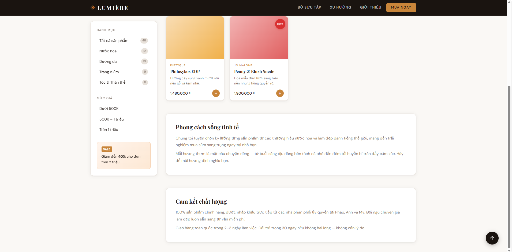
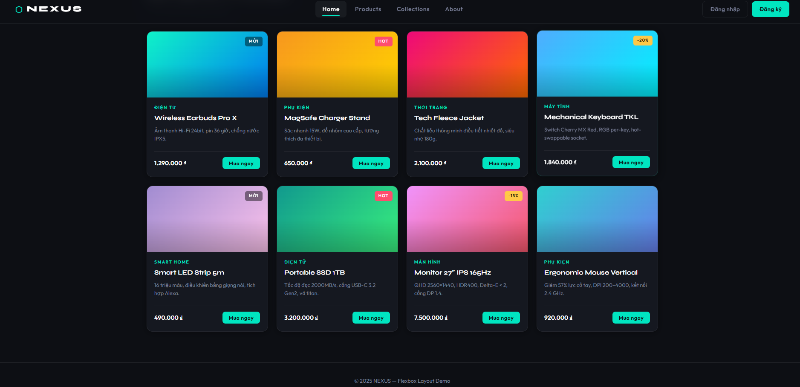
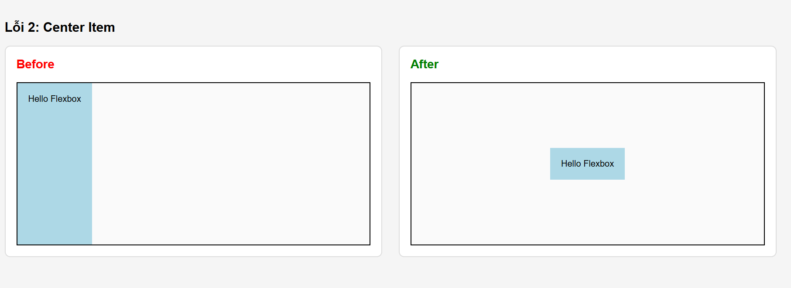
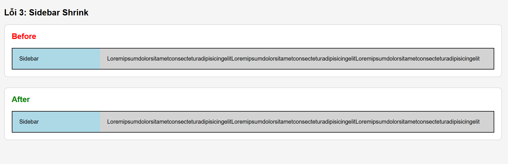

# PHIẾU BÀI TẬP 04
# **CSS LAYOUT — Positioning, Flexbox & Grid**

> **Tài liệu tham chiếu:** `12_css_positioning.md` + `13_creating_responsive_layouts.md`
>
---

## PHẦN A — KIỂM TRA ĐỨC HIỂU (20 điểm)

### Bảng so sánh

| Position | Vẫn chiếm chỗ trong flow? | Tham chiếu vị trí | Cuộn theo trang? | Use case điển hình |
|---|---|---|---|---|
| `static` | ✅ Có | Không áp dụng (top/left/right/bottom bị bỏ qua) | ✅ Có | Mặc định — mọi phần tử bình thường |
| `relative` | ✅ Có (giữ nguyên chỗ cũ) | Chính nó (so với vị trí gốc của nó) | ✅ Có | Dịch chuyển nhẹ; làm "anchor" cho con `absolute` |
| `absolute` | ❌ Không (bị lấy ra khỏi flow) | **Nearest positioned ancestor** (hoặc `<body>` nếu không có) | ✅ Có (cuộn cùng nội dung) | Dropdown menu, tooltip, badge thông báo |
| `fixed` | ❌ Không (bị lấy ra khỏi flow) | **Viewport** (cửa sổ trình duyệt) | ❌ Không (đứng yên khi cuộn) | Navbar dính trên đầu, nút "Back to top", chat widget góc màn hình |
| `sticky` | ✅ Có (cho đến khi đạt ngưỡng) | Viewport + flow bình thường — lai giữa `relative` và `fixed` | 🔁 Một phần — cuộn theo cho đến khi chạm ngưỡng `top/left`, sau đó dính lại | Header bảng dính khi cuộn, mục lục sidebar |

---

### Câu hỏi thêm: `absolute` tham chiếu body hay parent?

#### Quy tắc: "Nearest Positioned Ancestor"

Khi một phần tử có `position: absolute`, trình duyệt **leo lên cây DOM** để tìm tổ tiên **gần nhất** có `position` là một trong các giá trị: `relative`, `absolute`, `fixed`, hoặc `sticky`. Phần tử đó gọi là **positioned ancestor**.

```
position: static  → KHÔNG tính (bị bỏ qua)
position: relative → ✅ TÌM THẤY → dùng làm tham chiếu
position: absolute → ✅ TÌM THẤY → dùng làm tham chiếu
position: fixed    → ✅ TÌM THẤY → dùng làm tham chiếu
position: sticky   → ✅ TÌM THẤY → dùng làm tham chiếu
```

#### Khi nào tham chiếu `<body>`?

Khi **không có tổ tiên nào** được positioned (tất cả đều là `static`), phần tử `absolute` sẽ tham chiếu **initial containing block** — về cơ bản là `<html>` / `<body>`.

```html
<!-- ❌ Không có positioned ancestor → tham chiếu body -->
<div style="position: static;">          <!-- bị bỏ qua -->
  <div style="position: absolute; top: 20px; left: 20px;">
    Tôi neo vào góc trên trái của BODY
  </div>
</div>
```

#### Khi nào tham chiếu parent?

Khi **parent (hoặc tổ tiên nào đó)** có `position: relative` (hoặc absolute/fixed/sticky).

```html
<!-- ✅ Có positioned ancestor → tham chiếu parent -->
<div style="position: relative; width: 300px; height: 200px;">
  <div style="position: absolute; top: 20px; left: 20px;">
    Tôi neo vào góc trên trái của DIV CHA
  </div>
</div>
```

#### Ví dụ thực tế — Pattern cực phổ biến:

```css
/* Kỹ thuật: đặt relative cho cha, absolute cho con */
.card {
  position: relative; /* ← "Tôi là điểm neo" */
}

.badge {
  position: absolute; /* ← "Tôi neo vào .card" */
  top: -8px;
  right: -8px;
}
```

> **Tóm tắt:** `absolute` luôn tìm **tổ tiên gần nhất có `position` khác `static`**. Nếu không tìm thấy → dùng `body`. Đây là lý do pattern `relative` + `absolute` rất phổ biến: ta tạo "vùng neo" có chủ ý.

---

## Câu A2 (10đ) — Flexbox vs Grid: Dự đoán Layout

---

### Trường hợp 1

```css
.container { display: flex; }
.item { flex: 1; }
/* 4 items */
```

**Dự đoán:** 4 cột bằng nhau trên 1 hàng ngang

```
┌──────────┬──────────┬──────────┬──────────┐
│  Item 1  │  Item 2  │  Item 3  │  Item 4  │
│  (25%)   │  (25%)   │  (25%)   │  (25%)   │
└──────────┴──────────┴──────────┴──────────┘
```

**Giải thích:**
- `display: flex` → hướng mặc định là `row` (ngang)
- `flex: 1` = `flex-grow: 1, flex-shrink: 1, flex-basis: 0%`
- Tất cả 4 item có `flex-grow` bằng nhau → chia đều không gian → mỗi item chiếm **25%**

---

### Trường hợp 2

```css
.container { display: flex; flex-wrap: wrap; }
.item { width: 45%; margin: 2.5%; }
/* 6 items */
```

**Dự đoán:** 3 hàng × 2 cột

```
┌───────────────┐  ┌───────────────┐
│    Item 1     │  │    Item 2     │
│  (45% + 5%)  │  │  (45% + 5%)  │
└───────────────┘  └───────────────┘
┌───────────────┐  ┌───────────────┐
│    Item 3     │  │    Item 4     │
└───────────────┘  └───────────────┘
┌───────────────┐  ┌───────────────┐
│    Item 5     │  │    Item 6     │
└───────────────┘  └───────────────┘
```

**Giải thích:**
- Mỗi item chiếm: `width 45%` + `margin-left 2.5%` + `margin-right 2.5%` = **50% tổng chiều ngang**
- 2 item × 50% = 100% → vừa đủ 1 hàng → mỗi hàng chứa **2 item**
- 6 items ÷ 2 = **3 hàng**

---

### Trường hợp 3

```css
.container { display: flex; justify-content: space-between; align-items: center; }
/* 3 items */
```

**Dự đoán:** 3 item trải đều hai đầu, căn giữa dọc

```
┌─────────────────────────────────────────────┐
│                                             │
│ [Item1]        [Item2]              [Item3] │
│                                             │
└─────────────────────────────────────────────┘
```

**Giải thích:**
- `justify-content: space-between` → item đầu dán trái, item cuối dán phải, item giữa nằm chính giữa, **không có khoảng trống ở hai đầu**
- `align-items: center` → tất cả được căn giữa theo **trục dọc (cross axis)**
- Đây là layout cổ điển của **navbar** (logo trái | nav giữa | button phải)

---

### Trường hợp 4

```css
.container { display: grid; grid-template-columns: 200px 1fr 200px; gap: 20px; }
/* 3 items */
```

**Dự đoán:** 3 cột, 1 hàng — cột giữa co giãn linh hoạt

```
┌──────────┬──────────────────────────┬──────────┐
│          │                          │          │
│  Item 1  │         Item 2           │  Item 3  │
│  200px   │   (chiều rộng còn lại)   │  200px   │
│          │                          │          │
└──────────┴──────────────────────────┴──────────┘
```

**Giải thích:**
- Cột 1 = `200px` cố định
- Cột 3 = `200px` cố định
- Cột 2 = `1fr` → chiếm **toàn bộ không gian còn lại** sau khi trừ 2 × 200px và 2 × 20px gap
- Layout kinh điển: **Sidebar | Content | Sidebar**

---

### Trường hợp 5

```css
.container { display: grid; grid-template-columns: repeat(3, 1fr); gap: 10px; }
/* 7 items */
```

**Dự đoán:** 3 cột, 3 hàng — item 7 nằm ở hàng 3, cột 1 (bên trái)

```
┌──────────┬──────────┬──────────┐
│  Item 1  │  Item 2  │  Item 3  │  ← Hàng 1
├──────────┼──────────┼──────────┤
│  Item 4  │  Item 5  │  Item 6  │  ← Hàng 2
├──────────┼──────────┼──────────┤
│  Item 7  │  (trống) │  (trống) │  ← Hàng 3
└──────────┴──────────┴──────────┘
```

**Giải thích:**
- Grid tự động tạo hàng khi không đủ chỗ (`auto-fill` ngầm định)
- 7 items ÷ 3 cột = 2 hàng đầy + 1 hàng lẻ
- Item 7 xếp ở **hàng 3, cột 1** (Grid flow mặc định: trái → phải, trên → dưới)
- 2 ô còn lại của hàng 3 bị **bỏ trống** — Grid vẫn tạo ra chúng nhưng không có nội dung

> 💡 **Mẹo:** Nếu muốn item cuối tự căn đẹp, dùng thêm `.item:last-child { grid-column: span 3; }` hoặc dùng `justify-items: center`.

## PHẦN B — THỰC HÀNH CODE (60 điểm)

### Bài B1 (15đ) — Positioning Playground:

1. Trạng thái header khi scroll (chứng minh header fixed)

;

2. Trạng thái sidebar khi scroll (chứng minh sticky)

;


3. Badge trên card

;

### Bài B2 (20đ) — Flexbox Navigation & Cards

;

### Bài B3 (25đ) — Grid Layout — Trang E-Commerce

;

## PHẦN C — SUY LUẬN (20 điểm)

### Câu C1 (10đ) — Flexbox vs Grid: Khi nào dùng gì?
### 1. Navigation bar ngang (logo + menu + buttons)
* **Lựa chọn:** Dùng **Flexbox**.
* **Giải thích:** Thanh điều hướng (Navbar) là một layout theo trục ngang. Flexbox cực kỳ mạnh mẽ trong việc căn chỉnh và phân phối các khối dọc theo một trục đơn, giúp dễ dàng đẩy logo sang trái, nút bấm sang phải và căn giữa các phần tử theo chiều dọc một cách hoàn hảo thông qua `align-items: center`.

### 2. Lưới ảnh Instagram (3 cột đều nhau, số ảnh không biết trước)
* **Lựa chọn:** Dùng **Grid**.
* **Giải thích:** Đây là bố cục dạng lưới có cấu trúc số cột cố định (3 cột). Với CSS Grid, ta chỉ cần khai báo `grid-template-columns: repeat(3, 1fr)` cho container. Dù số lượng ảnh đổ về nhiều hay ít, trình duyệt sẽ tự động tính toán và xếp chúng thẳng hàng tăm tắp theo cả hàng dọc lẫn hàng ngang mà không lo bị lệch dòng.

### 3. Layout blog: main content + sidebar
* **Lựa chọn:** Dùng **Grid** (Hoặc dùng **Flexbox** đều được, nhưng Grid tối ưu hơn).
* **Giải thích:** Phân chia các khu vực lớn của một trang web (Page Layout) như vùng Nội dung chính (Main Content) và Thanh bên (Sidebar) nên được quản lý bằng CSS Grid (`grid-template-columns: 1fr 300px`). Grid giúp định hình khung tổng thể một cách cố định, rõ ràng và cực kỳ thuận tiện khi cần Responsive để dồn hàng khi chuyển sang màn hình di động.

### 4. Footer với 4 cột thông tin (Về chúng tôi, Liên kết, Hỗ trợ, Liên hệ)
* **Lựa chọn:** **Kết hợp cả hai**.
* **Giải thích:** * Sử dụng **Grid** cho khung lớn ngoài cùng của Footer để chia cấu trúc thành 4 cột bằng nhau (`grid-template-columns: repeat(4, 1fr)`), đảm bảo các khối thông tin luôn đồng bộ về độ rộng và khoảng cách `gap`.
  * Sử dụng **Flexbox** (`flex-direction: column`) bên trong từng cột nhỏ để xếp các đường link danh sách (dạng text) theo hàng dọc từ trên xuống dưới một cách linh hoạt.

### 5. Card sản phẩm (ảnh trên, text giữa, nút dưới — nút luôn dính đáy)
* **Lựa chọn:** Dùng **Flexbox**.
* **Giải thích:** Bản thân một Card sản phẩm là một luồng bố cục một chiều theo trục dọc (`flex-direction: column`). Khi kích hoạt Flexbox cho Card, ta có thể áp dụng thuộc tính `margin-top: auto` cho nút bấm nằm dưới cùng.

---

### Câu C2 (10đ) — Debug Flexbox

**Lỗi 1:** Cards không đều chiều cao — nút "Mua" bị nhảy lên/xuống

* **Nguyên nhân:** Các card có lượng nội dung khác nhau nên chiều cao mỗi card khác nhau. Do đó nút "Mua" không nằm cùng vị trí giữa các card. Ngoài ra `.card` chưa dùng Flexbox theo chiều dọc nên không thể đẩy nút xuống cuối card. 
* **Code sửa:**
```css
.card-container {
    display: flex;
    flex-wrap: wrap;
}
.card {
    width: 30%;
    margin: 1.5%;
    display: flex;
    flex-direction: column;
}
.card img {
    width: 100%;
}
.card h3 {
    font-size: 18px;
}
.card .btn {
    padding: 10px;
    margin-top: auto;
}
```

* **Kết quả sau khi sửa:**
;

**Lỗi 2**: Muốn items nằm giữa cả ngang lẫn dọc nhưng vẫn dính góc trái trên
* **Nguyên nhân:** `display: flex` chỉ kích hoạt Flexbox nhưng chưa canh giữa nên item vẫn nằm góc trên bên trái.

* **Code sửa:**
```css
.hero {
    height: 100vh;
    display: flex;
    justify-content: center;
    align-items: center;
}
.hero-content {
    text-align: center;
}
```
* **Kết quả sau khi sửa:**
;

**Lỗi 3:** Sidebar bị co lại khi content quá dài
* **Nguyên nhân:** Flexbox sẽ co các phần tử lại để đủ không gian khi content quá dài
* **Code sửa:**
```css
.layout {
    display: flex;
}
.sidebar {
    width: 250px;
    flex-shrink: 0;
}
.content {
    flex: 1;
}
```
* **Kết quả sau khi sửa:**
;
