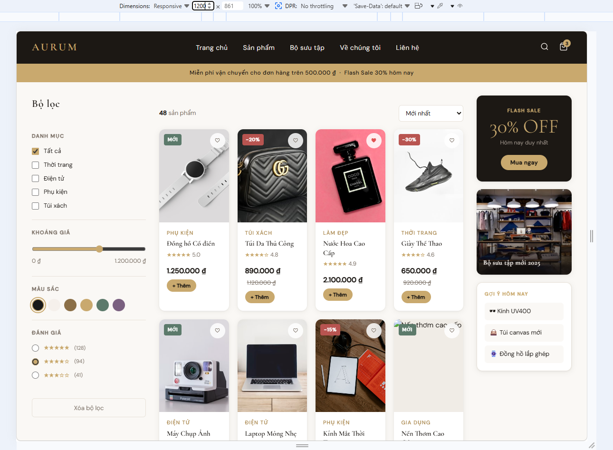
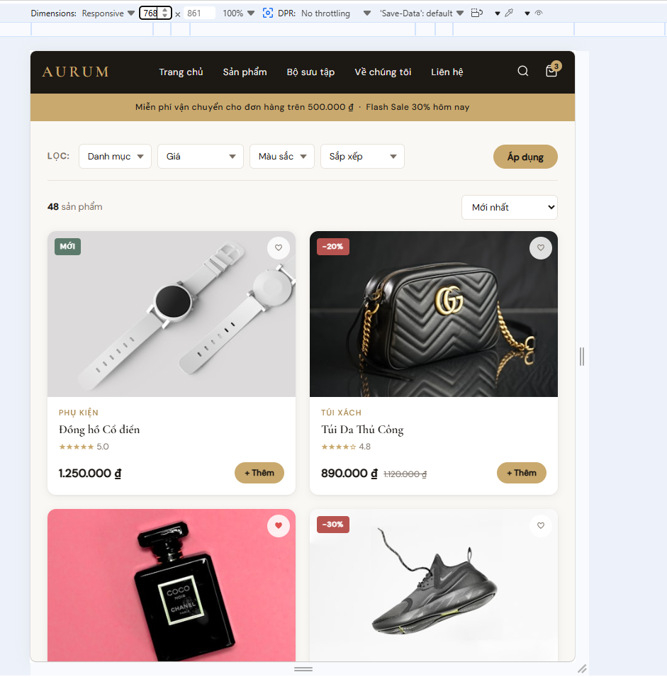
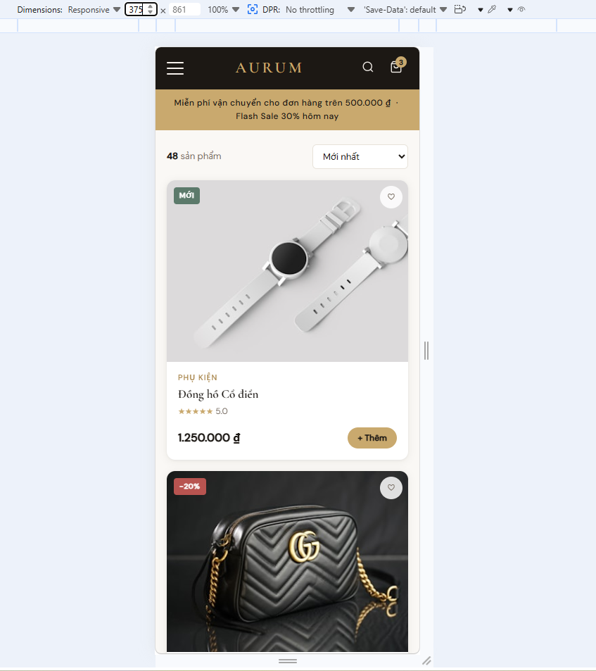

# PHIẾU BÀI TẬP 05

# **CSS RESPONSIVE & SCSS — Responsive Design, Media Queries, Sass**

## PHẦN A — KIỂM TRA ĐỌC HIỂU (20 điểm)

## Câu A1 (5đ) — Viewport & Mobile-First

### 1. Thẻ `<meta viewport>` chuẩn

```html
<meta name="viewport" content="width=device-width, initial-scale=1.0">
```

**Giải thích từng thuộc tính:**

| Thuộc tính | Giá trị | Ý nghĩa |
|---|---|---|
| `name="viewport"` | — | Khai báo đây là thẻ meta điều khiển viewport (vùng hiển thị) của trình duyệt mobile |
| `width=device-width` | chiều rộng thiết bị | Đặt chiều rộng viewport bằng đúng chiều rộng vật lý của màn hình thiết bị (thay vì dùng giá trị mặc định ~980px) |
| `initial-scale=1.0` | tỉ lệ 1:1 | Đặt mức zoom ban đầu là 100% — không phóng to, không thu nhỏ khi trang vừa tải |

> **Thuộc tính bổ sung hay dùng (không bắt buộc):**
> - `maximum-scale=1.0` — ngăn người dùng zoom
> - `user-scalable=no` — tắt hoàn toàn zoom (không khuyến khích vì ảnh hưởng accessibility)

---

### 2. Nếu THIẾU thẻ `<meta viewport>`, iPhone hiển thị như thế nào?

Khi thiếu thẻ viewport, trình duyệt Safari trên iPhone sẽ:

- **Giả định viewport rộng ~980px** (giá trị mặc định của WebKit) thay vì chiều rộng thực của màn hình (~375–430px).
- **Thu nhỏ toàn bộ trang** để vừa với màn hình → chữ rất nhỏ, không đọc được.
- Người dùng phải **pinch-to-zoom** để đọc nội dung → trải nghiệm rất tệ.
- Các media query `max-width`/`min-width` **không hoạt động đúng** vì trình duyệt báo cáo viewport là 980px, không phải kích thước thực.

**Tóm lại:** Trang web sẽ trông như phiên bản desktop thu nhỏ, không responsive.

---

### 3. Mobile-First vs Desktop-First

#### Mobile-First (khuyên dùng)
> Viết CSS mặc định cho màn hình nhỏ trước, dùng `min-width` để mở rộng lên.

```css
/* Mặc định: mobile (< 768px) */
.container {
  display: flex;
  flex-direction: column;
  padding: 16px;
}

/* Tablet trở lên (≥ 768px) */
@media (min-width: 768px) {
  .container {
    flex-direction: row;
    padding: 32px;
  }
}
```

#### Desktop-First
> Viết CSS mặc định cho màn hình lớn trước, dùng `max-width` để thu nhỏ xuống.

```css
/* Mặc định: desktop (> 768px) */
.container {
  display: flex;
  flex-direction: row;
  padding: 32px;
}

/* Mobile (≤ 768px) */
@media (max-width: 768px) {
  .container {
    flex-direction: column;
    padding: 16px;
  }
}
```

#### Tại sao Mobile-First được khuyên dùng?

1. **Hiệu năng tốt hơn:** Mobile tải CSS tối thiểu cần thiết; CSS desktop chỉ tải khi màn hình đủ rộng.
2. **Ưu tiên nội dung:** Buộc lập trình viên xác định nội dung quan trọng nhất trước (mobile không có chỗ thừa).
3. **Progressive Enhancement:** Bắt đầu từ nền tảng đơn giản, dần thêm tính năng cho màn hình lớn hơn — dễ bảo trì.
4. **Google ưu tiên:** Từ 2019, Google dùng Mobile-First Indexing → SEO tốt hơn.
5. **Thực tế sử dụng:** Hơn 60% traffic web toàn cầu đến từ thiết bị di động.

---

## Câu A2 (5đ) — Breakpoints

### Breakpoints chuẩn theo Bootstrap 5

| Tên | Kích thước (min-width) | Thiết bị đại diện | Lưới sản phẩm (gợi ý số cột) |
|---|---|---|---|
| **xs** (Extra small) | < 576px | Điện thoại nhỏ (iPhone SE, Galaxy A) | **1 cột** |
| **sm** (Small) | ≥ 576px | Điện thoại lớn (iPhone 14, Pixel) | **2 cột** |
| **md** (Medium) | ≥ 768px | Tablet đứng (iPad Mini, Galaxy Tab) | **2–3 cột** |
| **lg** (Large) | ≥ 992px | Tablet ngang / Laptop nhỏ | **3–4 cột** |
| **xl** (Extra large) | ≥ 1200px | Laptop, Desktop | **4 cột** |
| **xxl** (Extra extra large) | ≥ 1400px | Màn hình lớn, 4K | **4–6 cột** |

> **Ví dụ thực tế — lưới sản phẩm Shopee/Tiki:**
> - Mobile: 2 cột (mỗi sản phẩm chiếm 50% width)
> - Tablet: 3 cột
> - Desktop: 4–5 cột

---

## Câu A3 (5đ) — Media Queries

### CSS phân tích

```css
.container { width: 100%; padding: 10px; }

@media (min-width: 576px)  { .container { width: 540px; } }
@media (min-width: 768px)  { .container { width: 720px; } }
@media (min-width: 992px)  { .container { width: 960px; } }
@media (min-width: 1200px) { .container { width: 1140px; } }
```

### Bảng kết quả

| Chiều rộng màn hình | Điều kiện khớp | `.container` width |
|---|---|---|
| **375px** (iPhone SE) | Không khớp media query nào (375 < 576) | `100%` (= 375px) |
| **600px** | Khớp `min-width: 576px` | `540px` |
| **800px** | Khớp `min-width: 576px` và `min-width: 768px` → lấy rule cuối | `720px` |
| **1000px** | Khớp đến `min-width: 992px` | `960px` |
| **1400px** | Khớp tất cả → lấy rule cuối `min-width: 1200px` | `1140px` |

> **Nguyên tắc đọc Media Query:** Khi nhiều rule cùng khớp, **rule viết sau** sẽ thắng (cascade). Vì vậy thứ tự viết từ nhỏ → lớn rất quan trọng trong Mobile-First.

---

## Câu A4 (5đ) — SCSS Basics

### 4 tính năng chính của SCSS

---

#### 1. Variables — Biến (`$primary-color`)

Cho phép lưu giá trị tái sử dụng (màu sắc, font, kích thước) vào biến có tên. Thay đổi 1 chỗ → áp dụng toàn bộ.

```scss
// Khai báo biến
$primary-color: #3498db;
$font-size-base: 16px;
$border-radius: 8px;

// Sử dụng biến
.button {
  background-color: $primary-color;
  font-size: $font-size-base;
  border-radius: $border-radius;
}

.link {
  color: $primary-color;
}
```

**CSS output:**
```css
.button {
  background-color: #3498db;
  font-size: 16px;
  border-radius: 8px;
}
.link {
  color: #3498db;
}
```

---

#### 2. Nesting — CSS lồng nhau

Viết CSS theo cấu trúc cây HTML, tránh lặp selector. Dùng `&` để tham chiếu selector cha.

```scss
// SCSS
nav {
  background: #333;
  padding: 10px;

  ul {
    list-style: none;
    margin: 0;
  }

  li {
    display: inline-block;

    a {
      color: white;
      text-decoration: none;

      &:hover {           // & = li a (selector cha)
        color: #3498db;
        text-decoration: underline;
      }

      &.active {          // li a.active
        font-weight: bold;
      }
    }
  }
}
```

**CSS output:**
```css
nav { background: #333; padding: 10px; }
nav ul { list-style: none; margin: 0; }
nav li { display: inline-block; }
nav li a { color: white; text-decoration: none; }
nav li a:hover { color: #3498db; text-decoration: underline; }
nav li a.active { font-weight: bold; }
```

---

#### 3. Mixins — `@mixin` và `@include`

Định nghĩa khối CSS có thể tái sử dụng, hỗ trợ **tham số** (như function). Dùng khi cần lặp lại một nhóm thuộc tính ở nhiều nơi.

```scss
// Định nghĩa mixin có tham số
@mixin flex-center($direction: row) {
  display: flex;
  justify-content: center;
  align-items: center;
  flex-direction: $direction;
}

@mixin responsive-font($min: 14px, $max: 20px) {
  font-size: $min;

  @media (min-width: 768px) {
    font-size: $max;
  }
}

// Sử dụng mixin
.hero {
  @include flex-center(column);   // truyền tham số
  height: 100vh;
  @include responsive-font(16px, 24px);
}

.card {
  @include flex-center;           // dùng giá trị mặc định (row)
}
```

---

#### 4. `@extend` — Kế thừa (Inheritance)

Cho phép một selector **kế thừa toàn bộ style** của selector khác. Khác với mixin: `@extend` không nhận tham số và dùng cho các class có cùng bản chất.

```scss
// Style gốc
%button-base {
  display: inline-block;
  padding: 10px 20px;
  border: none;
  border-radius: 4px;
  cursor: pointer;
  font-size: 14px;
}

// Kế thừa và mở rộng
.button-primary {
  @extend %button-base;
  background-color: #3498db;
  color: white;
}

.button-danger {
  @extend %button-base;
  background-color: #e74c3c;
  color: white;
}

.button-outline {
  @extend %button-base;
  background-color: transparent;
  border: 2px solid #3498db;
  color: #3498db;
}
```

**CSS output (tối ưu — gộp chung selector):**
```css
.button-primary, .button-danger, .button-outline {
  display: inline-block;
  padding: 10px 20px;
  border: none;
  border-radius: 4px;
  cursor: pointer;
  font-size: 14px;
}
.button-primary { background-color: #3498db; color: white; }
.button-danger   { background-color: #e74c3c; color: white; }
.button-outline  { background-color: transparent; border: 2px solid #3498db; color: #3498db; }
```

> **So sánh nhanh `@mixin` vs `@extend`:**
>
> | | `@mixin` | `@extend` |
> |---|---|---|
> | Tham số | ✅ Có | ❌ Không |
> | Output CSS | Sao chép vào mỗi nơi | Gộp selector, gọn hơn |
> | Dùng khi | Cần tùy biến giá trị | Chia sẻ style y hệt nhau |

---

### Tại sao trình duyệt KHÔNG đọc được file `.scss`?

Trình duyệt (Chrome, Firefox, Safari...) **chỉ hiểu CSS thuần** theo chuẩn W3C. File `.scss` chứa cú pháp mở rộng (biến `$`, nesting, mixin, ...) **không thuộc chuẩn CSS** — trình duyệt không có bộ xử lý để phân tích cú pháp này.

### Các bước chuyển SCSS → CSS

```
File .scss  →  [SCSS Compiler]  →  File .css  →  Trình duyệt đọc
```

**Các công cụ biên dịch phổ biến:**

| Công cụ | Cách dùng |
|---|---|
| **Dart Sass** (chính thức) | `sass input.scss output.css` |
| **Node-sass / sass npm** | Tích hợp trong Node.js project |
| **Webpack + sass-loader** | Tự động compile khi build project |
| **Vite / Create React App** | Hỗ trợ SCSS sẵn, chỉ cần import file `.scss` |
| **VS Code Extension** | "Live Sass Compiler" — compile tự động khi lưu file |

**Ví dụ dùng Dart Sass trên terminal:**
```bash
# Cài đặt
npm install -g sass

# Compile một lần
sass styles.scss styles.css

# Compile tự động khi file thay đổi (watch mode)
sass --watch styles.scss:styles.css
```

> **Tóm lại:** `.scss` là ngôn ngữ tiền xử lý (preprocessor language) — cần compile thành `.css` trước khi deploy lên web.

## PHẦN B — THỰC HÀNH CODE (60 điểm)

### Bài B1 (25đ) — Responsive Product Page

**Desktop (≥ 1024px):**



**Tablet (768px - 1023px):**



**Mobile (< 768px):**



### Bài B3 (20đ) — SCSS Refactor

## Lệnh compile SCSS → CSS
 
### 1. Compile một lần (development – expanded)
```bash
sass style.scss style.css --style=expanded
```
 
### 2. Compile một lần (production – minified)
```bash
sass style.scss style.min.css --style=compressed
```
 
### 3. Watch mode – tự động compile khi có thay đổi
```bash
sass --watch style.scss:style.css
```
 
### 4. Watch mode + source map
```bash
sass --watch style.scss:style.css --source-map
```
 
### 5. Watch + minified (production workflow)
```bash
sass --watch style.scss:style.min.css --style=compressed --no-source-map
```
 
### Cài đặt Sass (nếu chưa có)
```bash
npm install -g sass
sass --version
```
 
---
 
## SCSS Features đã sử dụng
 
### Variables (`_variables.scss`)
Tổng cộng **20+ biến**, bao gồm đủ 8 biến yêu cầu:
 
| Biến | Giá trị | Mục đích |
|---|---|---|
| `$primary-color` | `#c9a96e` | Gold accent (nút, icon, logo) |
| `$secondary-color` | `#1c1814` | Deep brown-black (text, header bg) |
| `$font-primary` | `'DM Sans', system-ui, sans-serif` | Font body |
| `$font-display` | `'Cormorant Garamond', Georgia, serif` | Font heading/logo |
| `$breakpoint-tablet` | `768px` | Responsive tablet |
| `$breakpoint-desktop` | `1024px` | Responsive desktop |
| `$spacing-sm` | `8px` | Spacing nhỏ |
| `$spacing-md` | `16px` | Spacing trung bình |
| `$spacing-lg` | `32px` | Spacing lớn |
 
---
 
### Nesting (`_components.scss`)
Nhiều hơn 3 blocks nested theo yêu cầu. Ví dụ tiêu biểu:
 
```scss
// Block 1: .site-header
.site-header {
  .header-inner { ... }
  .logo { ... }
  .icon-btn {
    &:hover { ... }
    .cart-badge { ... }
  }
}
 
// Block 2: .product-card
.product-card {
  .card-img-wrap { img { ... } }
  .wishlist-btn  { &:hover { ... } &.active { ... } }
  .card-body     { ... }
  .card-footer   { ... }
  .btn-add       { &.added { ... } }
  &:hover .card-img-wrap img { transform: scale(1.06); }
  @for $i from 2 through 8 { &:nth-child(#{$i}) { animation-delay: ...; } }
}
 
// Block 3: .main-nav
.main-nav {
  &.open { ... }
  a { &:hover { ... } }
  @include respond-to(tablet) { a { &:hover { ... } } }
}
 
// Block 4: .site-footer
.site-footer {
  .footer-inner { ... }
  .footer-brand { .footer-logo { ... } .footer-tagline { ... } }
  .footer-col   { h5 { ... } a { &:hover { ... } } }
  .newsletter-form { input { &::placeholder { ... } } button { &:hover { ... } } }
}
```
 
---
 
### Mixins (`_mixins.scss`)
Tổng cộng **8 mixins**:
 
| Mixin | Tham số | Mục đích |
|---|---|---|
| `respond-to($breakpoint)` | `tablet` / `desktop` / `xl` | Media query wrapper |
| `flex-center($direction)` | `row` (default) / `column` | Flexbox centering |
| `card-shadow($hover)` | `false` (default) / `true` | Box shadow + hover state |
| `btn-gold($size)` | `sm` / `md` / `lg` | Gold CTA button styles |
| `truncate` | – | Overflow text ellipsis |
| `sr-only` | – | Screen-reader only |
| `custom-select` | – | Custom dropdown arrow |
| `badge($bg)` | màu nền | Absolute-positioned badge chip |
 
---
 
### Partial & Import
Dùng **Sass Modules** (`@use`) thay vì `@import` (đã deprecated):
 
```scss
// style.scss — main entry
@use 'scss/variables' as *;
@use 'scss/mixins'    as *;
@use 'scss/components';
 
// _mixins.scss — dùng variables
@use 'variables' as *;
 
// _components.scss — dùng cả hai
@use 'variables' as *;
@use 'mixins'    as *;
```
 
> **Lưu ý:** `@use` với `as *` để import vào global namespace (dùng trực tiếp `$primary-color` thay vì `variables.$primary-color`). Đây là cách hiện đại và được khuyến nghị từ Sass 1.23+.
 
---
 
## Kết quả compile
 
| File output | Kích thước | Ghi chú |
|---|---|---|
| `style.css` | ~1075 dòng | Expanded, dễ đọc cho dev |
| `style.min.css` | ~17 KB | Compressed, dùng cho production |

## PHẦN C — PHÂN TÍCH (20 điểm)

### Câu C1 (10đ) — Phân tích trang web thực

1. Trang web Youtube:

**Mobile (375px):**


**Tablet (765px):**


**Desktop (1200px):**


2. Giải thích (Navigation + Grid + Elements ẩn + Font)

- **Navigation thay đổi thế nào? (hamburger? dropdown?)**
  - **Mobile:** thanh điều hướng rút gọn, có **hamburger/menu** (icon) để mở các mục thay vì hiển thị đầy đủ link.
  - **Tablet:** bắt đầu mở rộng menu hơn; các mục có thể hiển thị rõ hơn (không còn quá “tối giản” như mobile).
  - **Desktop:** hiển thị đầy đủ **menu/navigation dạng ngang**, không cần hamburger.

- **Lưới content thay đổi mấy cột?**
  - **Mobile:** **1 cột** card/video mỗi hàng.
  - **Tablet:** **2 cột**.
  - **Desktop:** **4 cột**.

- **Elements nào bị ẩn trên mobile?**
  - **Sidebar/bộ lọc và phần menu đầy đủ** (hiển thị dạng hamburger thay vì hiện sẵn).

- **Font size có thay đổi không?**
  - **Có thay đổi nhẹ**: mobile dùng font và khoảng cách nhỏ hơn để vừa màn hình; tablet/desktop font lớn hơn và thoáng hơn.