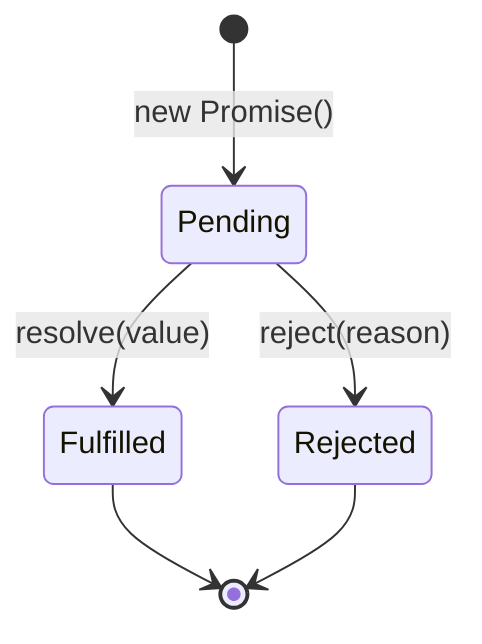

# PHIẾU BÀI TẬP 10
# **ASYNC JAVASCRIPT & API INTEGRATION**

## PHẦN A — KIỂM TRA ĐỌC HIỂU (15 điểm)

### Câu A1 (5đ) — Sync vs Async

### Thứ tự output

```bash
1 - Start
4 - End
3 - Promise
6 - Promise 2
2 - Timeout 0ms
7 - Nested timeout
5 - Timeout 100ms
```

### Giải thích chi tiết (Event Loop)

JavaScript chạy theo cơ chế **single-threaded** với **Event Loop**.

#### 1. Các khái niệm chính:

- **Call Stack**: Nơi thực thi code đồng bộ (synchronous).
- **Microtask Queue**: Ưu tiên cao (Promise `.then`, `.catch`, `queueMicrotask`, `MutationObserver`).
- **Macrotask Queue** (Task Queue): Ưu tiên thấp hơn (`setTimeout`, `setInterval`, `setImmediate`, I/O, UI rendering...).
- **Event Loop**: Khi Call Stack rỗng, Event Loop sẽ:
  1. Xử lý **tất cả** microtasks trước.
  2. Xử lý **một** macrotask.
  3. Quay lại kiểm tra microtasks (và lặp lại).

#### 2. Phân tích code từng bước:

1. `console.log("1 - Start")` → **Sync** → in ngay.
2. `setTimeout(..., 0)` → đưa vào **Macrotask Queue** (gọi là Timeout A).
3. `Promise.resolve().then(...)` → đưa callback vào **Microtask Queue** (Promise 1).
4. `console.log("4 - End")` → **Sync** → in ngay.
5. `setTimeout(..., 100)` → đưa vào **Macrotask Queue** (Timeout B).
6. `Promise.resolve().then(...)` → đưa vào **Microtask Queue** (Promise 2).  
   Trong Promise 2 có `setTimeout` → sẽ đẩy "7 - Nested timeout" vào **Macrotask Queue** khi Promise 2 chạy.

**Sau khi Sync code chạy xong** (Call Stack rỗng):

- **Microtask Queue** (ưu tiên cao):
  - Chạy "3 - Promise"
  - Chạy "6 - Promise 2" → đẩy "7 - Nested timeout" vào Macrotask Queue

- **Macrotask Queue**:
  - "2 - Timeout 0ms" (queue trước)
  - "7 - Nested timeout"
  - "5 - Timeout 100ms" (delay 100ms)

---

## Câu A2: Fetch API

### Giải thích từng dòng code

```js
async function getData() {
    try {
        const response = await fetch("https://api.example.com/data");
        
        if (!response.ok) {
            throw new Error(`HTTP ${response.status}`);
        }
        
        const data = await response.json();
        return data;
    } catch (error) {
        console.error("Failed:", error.message);
        return null;
    }
}
```

#### Câu hỏi:

**`await fetch(...)` — fetch trả về gì? Tại sao cần await?**

- `fetch()` trả về một **Promise** resolve thành object `Response`.
- `await` dùng để **dừng thực thi hàm async** cho đến khi Promise hoàn thành (Fulfilled hoặc Rejected), giúp code viết theo kiểu đồng bộ.

**`response.ok` — Khi nào false? Liệt kê 3 status codes tương ứng.**

`response.ok` là `true` khi status nằm trong khoảng **200-299**.

**False** khi:
- `404` (Not Found)
- `400` (Bad Request)
- `500` (Internal Server Error)
- `403` (Forbidden)
- `401` (Unauthorized)

**`response.json()` — Tại sao cần await lần nữa?**

`response.json()` cũng trả về một **Promise** (vì việc parse JSON là asynchronous). Nên cần `await` để lấy được dữ liệu thực tế.

**`try...catch` — Catch những lỗi gì?**

Catch được:
- **Network error** (không kết nối được, CORS error, DNS fail...).
- Lỗi khi `response.ok === false` (do chúng ta tự `throw`).
- **JSON parse error** (nếu body không phải JSON hợp lệ).
- Lỗi trong quá trình await (ví dụ: body đã được đọc trước đó).

**Không catch được**: Lỗi HTTP 4xx, 5xx nếu không kiểm tra `response.ok` (fetch không reject ở các status này, chỉ reject khi network failure).

---

## Câu A3: Promise States

### 3 trạng thái của Promise



**Giải thích**:
- **Pending**: Trạng thái ban đầu (chưa hoàn thành).
- **Fulfilled**: Hoàn thành thành công (`resolve`).
- **Rejected**: Hoàn thành thất bại (`reject`).

Một Promise chỉ chuyển trạng thái **một lần** và không thể thay đổi sau đó.

---

### Callback Hell là gì?

**Callback Hell** (hay Pyramid of Doom) là tình trạng code lồng nhau nhiều cấp callback, làm code khó đọc, khó maintain và debug.

#### Ví dụ 4 cấp Callback Hell:

```js
getUser(1, (user) => {
    getPosts(user.id, (posts) => {
        getComments(posts[0].id, (comments) => {
            getReplies(comments[0].id, (replies) => {
                console.log(replies);
            });
        });
    });
});
```

#### Refactor thành async/await:

```js
async function getAllData() {
    try {
        const user = await getUser(1);
        const posts = await getPosts(user.id);
        const comments = await getComments(posts[0].id);
        const replies = await getReplies(comments[0].id);
        
        console.log(replies);
        return replies;
    } catch (error) {
        console.error("Error:", error);
    }
}
```

**Lợi ích**:
- Code phẳng, dễ đọc.
- Dễ xử lý lỗi tập trung với `try...catch`.
- Dễ debug hơn.

---

## PHẦN C — PHÂN TÍCH (20 điểm)

## Câu C1 (10đ) — Error Handling Strategy cho E-Commerce App

### Chiến lược tổng quát

Khi xây dựng app E-Commerce, nên có **layered error handling**:
- **Global Error Boundary** (UI)
- **API Client Wrapper** (centralized)
- **User-friendly messages** + **Retry + Fallback**

---

### 1. Network Errors (mất mạng giữa chừng)

**Xử lý:**
- Phát hiện lỗi `TypeError: Failed to fetch` hoặc `ERR_INTERNET_DISCONNECTED`.
- Hiển thị thông báo "Mất kết nối. Vui lòng kiểm tra mạng." + nút Retry.
- Tự động retry với **exponential backoff**.

### 2. API Errors

| Status Code | Xử lý |
|-------------|------|
| **404**     | "Không tìm thấy dữ liệu" hoặc redirect về trang 404 |
| **500**     | "Lỗi máy chủ. Chúng tôi đang khắc phục." + log lỗi (Sentry) |
| **429** (Too Many Requests) | Delay theo `Retry-After` header hoặc exponential backoff + thông báo "Quá nhiều yêu cầu, vui lòng chờ" |

---

### 3. Timeout (API chậm > 10 giây)

```js
const fetchWithTimeout = async (url, options = {}, timeoutMs = 10000) => {
    const controller = new AbortController();
    const timeoutId = setTimeout(() => controller.abort(), timeoutMs);

    try {
        const response = await fetch(url, {
            ...options,
            signal: controller.signal
        });
        
        clearTimeout(timeoutId);
        return response;
    } catch (error) {
        clearTimeout(timeoutId);
        if (error.name === 'AbortError') {
            throw new Error(`Request timeout after ${timeoutMs}ms`);
        }
        throw error;
    }
};
```

**Sử dụng:**
```js
const data = await fetchWithTimeout('/api/products', {}, 10000);
```

---

### 4. Retry Logic (thử lại 3 lần nếu lỗi network)

```js
const fetchWithRetry = async (url, options = {}, maxRetries = 3) => {
    let lastError;

    for (let attempt = 0; attempt <= maxRetries; attempt++) {
        try {
            const response = await fetchWithTimeout(url, options, 10000);
            
            if (!response.ok) {
                if (response.status === 429) {
                    const retryAfter = response.headers.get('Retry-After') || 2000;
                    await new Promise(r => setTimeout(r, retryAfter));
                    continue;
                }
                throw new Error(`HTTP ${response.status}`);
            }
            
            return response;
        } catch (error) {
            lastError = error;
            
            // Chỉ retry với network error hoặc timeout
            if (!error.message.includes('timeout') && 
                !error.message.includes('Failed to fetch') && 
                attempt === maxRetries) {
                break;
            }

            // Exponential backoff
            if (attempt < maxRetries) {
                const delay = Math.pow(2, attempt) * 1000; // 1s, 2s, 4s
                await new Promise(r => setTimeout(r, delay));
            }
        }
    }

    throw lastError;
};
```

**Sử dụng:**
```js
const response = await fetchWithRetry('/api/cart/add', {
    method: 'POST',
    body: JSON.stringify(data)
});
```

---

## Câu C2 (10đ) — Promise.all vs Promise.allSettled vs Promise.race vs Promise.any

### Bảng so sánh

| Method            | Khi nào resolve?                          | Khi nào reject?                          | Use case thực tế |
|-------------------|------------------------------------------|------------------------------------------|------------------|
| **.all()**        | Tất cả promises đều **fulfilled**        | **Bất kỳ** promise nào reject            | Load nhiều dữ liệu quan trọng cùng lúc (product + reviews + recommendations) |
| **.allSettled()** | Luôn resolve sau khi tất cả hoàn thành   | Không bao giờ reject                     | Load nhiều API dashboard, muốn biết cái nào thành công/thất bại |
| **.race()**       | Promise nào hoàn thành **đầu tiên**      | Promise đầu tiên reject                  | Request nhiều server, lấy kết quả nhanh nhất (CDN fallback) |
| **.any()**        | Promise nào **fulfilled** đầu tiên       | Tất cả đều rejected                      | Gọi nhiều API dự phòng, lấy kết quả thành công đầu tiên |

---

### Ví dụ thực tế

#### 1. `Promise.all()` — Load trang Product Detail

```js
async function loadProductPage(productId) {
    try {
        const [product, reviews, recommendations] = await Promise.all([
            fetchWithRetry(`/api/products/${productId}`),
            fetchWithRetry(`/api/products/${productId}/reviews`),
            fetchWithRetry(`/api/products/${productId}/recommendations`)
        ]);
        
        return { product, reviews, recommendations };
    } catch (error) {
        console.error("Một trong các API bị lỗi:", error);
        // Có thể redirect hoặc thông báo lỗi
    }
}
```

---

#### 2. `Promise.allSettled()` — Dashboard Analytics

```js
async function loadDashboard() {
    const promises = [
        fetchWithRetry('/api/sales'),
        fetchWithRetry('/api/orders'),
        fetchWithRetry('/api/users'),           // có thể lỗi
        fetchWithRetry('/api/inventory')
    ];

    const results = await Promise.allSettled(promises);

    results.forEach((result, index) => {
        if (result.status === 'fulfilled') {
            console.log(`API ${index} thành công:`, result.value);
        } else {
            console.warn(`API ${index} thất bại:`, result.reason);
        }
    });
}
```

---

#### 3. `Promise.race()` — Timeout hoặc Fastest Response

```js
async function getFastestPrice(productId) {
    const sources = [
        fetchWithRetry(`/api/price?source=shopee`),
        fetchWithRetry(`/api/price?source=lazada`),
        fetchWithRetry(`/api/price?source=tiki`)
    ];

    // Lấy giá nhanh nhất trong 5 giây
    const result = await Promise.race([
        ...sources,
        new Promise((_, reject) => 
            setTimeout(() => reject(new Error("Timeout")), 5000)
        )
    ]);

    return result;
}
```

---

#### 4. `Promise.any()` — Multiple Fallback APIs

```js
async function getUserProfile(userId) {
    const sources = [
        fetchWithRetry(`/api/v1/users/${userId}`),   // primary
        fetchWithRetry(`/api/v2/users/${userId}`),   // backup
        fetchWithRetry(`/api/legacy/users/${userId}`) // legacy
    ];

    try {
        const response = await Promise.any(sources);
        return await response.json();
    } catch (error) {
        console.error("Tất cả sources đều thất bại");
        throw error;
    }
}
```

---