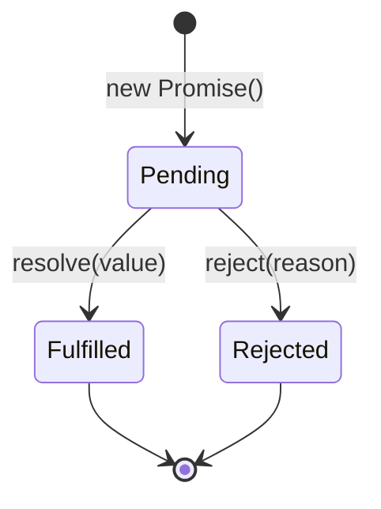

# PHIẾU BÀI TẬP 10
# **ASYNC JAVASCRIPT & API INTEGRATION**

## PHẦN A — KIỂM TRA ĐỌC HIỂU (15 điểm)

### Câu A1 (5đ) — Sync vs Async

### Thứ tự output

```bash
1 - Start
4 - End
3 - Promise
6 - Promise 2
2 - Timeout 0ms
7 - Nested timeout
5 - Timeout 100ms
```

### Giải thích chi tiết (Event Loop)

JavaScript chạy theo cơ chế **single-threaded** với **Event Loop**.

#### 1. Các khái niệm chính:

- **Call Stack**: Nơi thực thi code đồng bộ (synchronous).
- **Microtask Queue**: Ưu tiên cao (Promise `.then`, `.catch`, `queueMicrotask`, `MutationObserver`).
- **Macrotask Queue** (Task Queue): Ưu tiên thấp hơn (`setTimeout`, `setInterval`, `setImmediate`, I/O, UI rendering...).
- **Event Loop**: Khi Call Stack rỗng, Event Loop sẽ:
  1. Xử lý **tất cả** microtasks trước.
  2. Xử lý **một** macrotask.
  3. Quay lại kiểm tra microtasks (và lặp lại).

#### 2. Phân tích code từng bước:

1. `console.log("1 - Start")` → **Sync** → in ngay.
2. `setTimeout(..., 0)` → đưa vào **Macrotask Queue** (gọi là Timeout A).
3. `Promise.resolve().then(...)` → đưa callback vào **Microtask Queue** (Promise 1).
4. `console.log("4 - End")` → **Sync** → in ngay.
5. `setTimeout(..., 100)` → đưa vào **Macrotask Queue** (Timeout B).
6. `Promise.resolve().then(...)` → đưa vào **Microtask Queue** (Promise 2).  
   Trong Promise 2 có `setTimeout` → sẽ đẩy "7 - Nested timeout" vào **Macrotask Queue** khi Promise 2 chạy.

**Sau khi Sync code chạy xong** (Call Stack rỗng):

- **Microtask Queue** (ưu tiên cao):
  - Chạy "3 - Promise"
  - Chạy "6 - Promise 2" → đẩy "7 - Nested timeout" vào Macrotask Queue

- **Macrotask Queue**:
  - "2 - Timeout 0ms" (queue trước)
  - "7 - Nested timeout"
  - "5 - Timeout 100ms" (delay 100ms)

---

## Câu A2: Fetch API

### Giải thích từng dòng code

```js
async function getData() {
    try {
        const response = await fetch("https://api.example.com/data");
        
        if (!response.ok) {
            throw new Error(`HTTP ${response.status}`);
        }
        
        const data = await response.json();
        return data;
    } catch (error) {
        console.error("Failed:", error.message);
        return null;
    }
}
```

#### Câu hỏi:

**`await fetch(...)` — fetch trả về gì? Tại sao cần await?**

- `fetch()` trả về một **Promise** resolve thành object `Response`.
- `await` dùng để **dừng thực thi hàm async** cho đến khi Promise hoàn thành (Fulfilled hoặc Rejected), giúp code viết theo kiểu đồng bộ.

**`response.ok` — Khi nào false? Liệt kê 3 status codes tương ứng.**

`response.ok` là `true` khi status nằm trong khoảng **200-299**.

**False** khi:
- `404` (Not Found)
- `400` (Bad Request)
- `500` (Internal Server Error)
- `403` (Forbidden)
- `401` (Unauthorized)

**`response.json()` — Tại sao cần await lần nữa?**

`response.json()` cũng trả về một **Promise** (vì việc parse JSON là asynchronous). Nên cần `await` để lấy được dữ liệu thực tế.

**`try...catch` — Catch những lỗi gì?**

Catch được:
- **Network error** (không kết nối được, CORS error, DNS fail...).
- Lỗi khi `response.ok === false` (do chúng ta tự `throw`).
- **JSON parse error** (nếu body không phải JSON hợp lệ).
- Lỗi trong quá trình await (ví dụ: body đã được đọc trước đó).

**Không catch được**: Lỗi HTTP 4xx, 5xx nếu không kiểm tra `response.ok` (fetch không reject ở các status này, chỉ reject khi network failure).

---

## Câu A3: Promise States

### 3 trạng thái của Promise



**Giải thích**:
- **Pending**: Trạng thái ban đầu (chưa hoàn thành).
- **Fulfilled**: Hoàn thành thành công (`resolve`).
- **Rejected**: Hoàn thành thất bại (`reject`).

Một Promise chỉ chuyển trạng thái **một lần** và không thể thay đổi sau đó.

---

### Callback Hell là gì?

**Callback Hell** (hay Pyramid of Doom) là tình trạng code lồng nhau nhiều cấp callback, làm code khó đọc, khó maintain và debug.

#### Ví dụ 4 cấp Callback Hell:

```js
getUser(1, (user) => {
    getPosts(user.id, (posts) => {
        getComments(posts[0].id, (comments) => {
            getReplies(comments[0].id, (replies) => {
                console.log(replies);
            });
        });
    });
});
```

#### Refactor thành async/await:

```js
async function getAllData() {
    try {
        const user = await getUser(1);
        const posts = await getPosts(user.id);
        const comments = await getComments(posts[0].id);
        const replies = await getReplies(comments[0].id);
        
        console.log(replies);
        return replies;
    } catch (error) {
        console.error("Error:", error);
    }
}
```

**Lợi ích**:
- Code phẳng, dễ đọc.
- Dễ xử lý lỗi tập trung với `try...catch`.
- Dễ debug hơn.

---